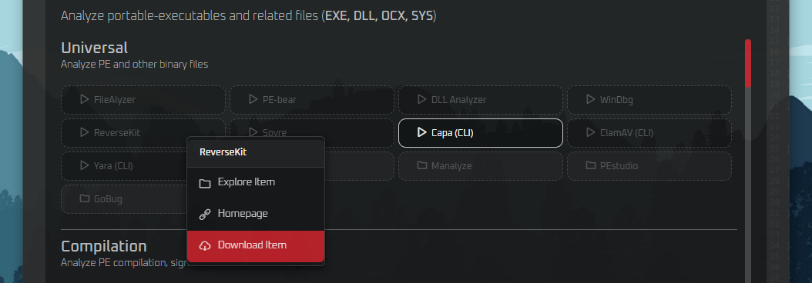
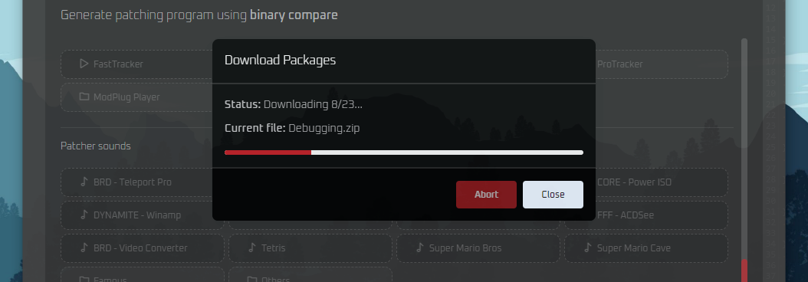
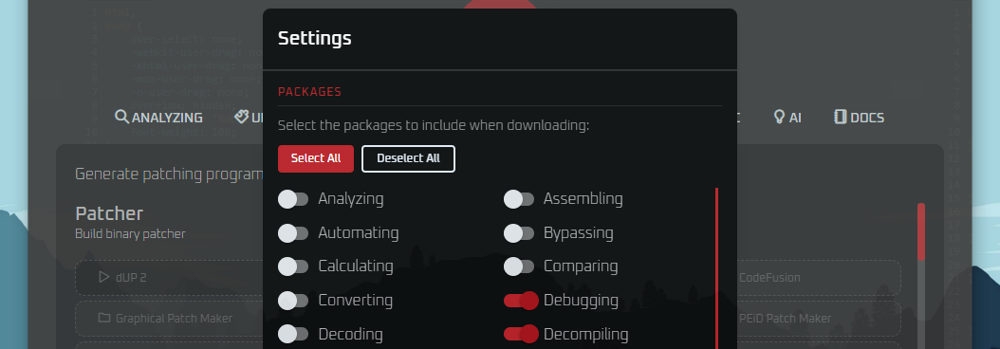

# ReVens: Reverse Engineering Toolkit AIO

[](#)

ReVens is a Windows-based and AI-powered Reverse Engineering Toolkit "All-In-One", built for security purposes (malware analysis, penetration testing) and educational use only. It serves as a comprehensive package manager for reverse engineering tools.

> [!Note]
> I made ReVens AIO software to share personal experience in RE since **2008**.  
> RE tools are priceless, especially the legacy ones. They deserve a nice place where they can live in peace.  
> You can still find legacy items on **Wayback Machine**.  
> [Watch online preview](https://revens.jihadsinnaour.com).

## 🔧 Features

* **Cross-platform & Modern UI** software launcher "Blackhat style"
* **90% clean**: All detections are **false positives**, No malware injected
* **90% portable**: Using portable versions or resolved/included dependencies
* **Original assets**: Themes, Sounds (e.g. BRD - Teleport Pro.mx, CORE - Power ISO.xm)
* **Packages manager**: JSON based Downloader, Versioning, Updater
* **AI-powered**: Basic AI assistant using Ollama (llama3.2:1b)
* **Boilerplate**: For other projects (Electron.js X React.js)

## 🔧 Screenshot

This is how it looks, Made with {heart} using **Electron.js** X **React.js**.  
*The App background is the WebView DevTools itself*.

[](#)

Each item can be downloaded **separately** from trusted sources.

[](#)

Packages are **automatically downloaded**.

[](#)

Local AI assistant integrated using **Ollama**.

[](#)

## 💡 Notices

> [!Important]
> Respecting the rights of software developers is paramount. Engaging in activities such as bypassing software protections or reverse engineering software without explicit permission is not only generally illegal, but also unethical. It's essential to utilize software in the manner intended by its creators and in compliance with the stipulated terms of service or license agreement.

* ReVens will focus only on the **package manager** itself and not the packages!
* Reverse engineering tools are flagged by **Antivirus** (due to binary patching algorithms, debugging, packing, etc.).
* You should use a **secure** virtual machine or a sandbox.
* Many of the included tools are **outdated** and provided solely for legacy purposes!
* The primary architecture of the packages is **x64**, but other architectures (x86, ARM) can also be supported.
* ReVens is Windows-based, but still **cross-platform** if you want to build it for Linux.
* *— Use it at your own risk. Better Call Saul! —*

## 🔧 Requirements

* **Windows** 10/11 x64 (Runtime)
* **Electron.js ^29.4.6 (Node 24.11.0)**
* **MinGW-w64** or [**Git for Windows**](https://git-scm.com/downloads/win)
* **Ollama** for AI Assistant [**ReVens AI Assistant Setup**](AI.md)

## 🔧 Build

```sh
git clone https://github.com/Jakiboy/ReVens .
bash init.sh
bash run.sh
bash build.sh
```

## 🔧 Test

```cmd
./scripts/test.cmd
./scripts/fix.cmd
./scripts/generate.cmd
```

## 🔧 Download

* Download latest ReVens from: [Releases](https://github.com/Jakiboy/ReVens/releases).

## 🔧 TODO

* We need contributors for: Advanced AI, Settings, and the Package Downloader.

## 🔧 Packages

ReVens packages includes:

<!-- Auto-generated: ReVens Packages Begin -->

### ⚡ Analyzing
Analyze portable-executables and related files (EXE, DLL, OCX, SYS).

##### Binary
*Analyze PE and other binary files.*
* **[Exe Spy](https://github.com/andyjsmith/Exe-Spy)** - *Exe Spy.*
* **FileAlyzer** - *Understand files by analyzing their structure.*
* **[PE-bear](https://github.com/hasherezade/pe-bear)** - *PE reversing tool.*
* **DLL Analyzer** - *Display function names in DLLs.*
* **[ReverseKit](https://github.com/zer0condition/ReverseKit)** - *Comprehensive reverse engineering toolkit.*
* **[Spyre](https://github.com/spyre-project/spyre)** - *Simple YARA-based scanner.*
* **[Com Check](https://www.bullzip.com/products/chk/info.php)** - *Check COM objects registration.*
* **[Capa](https://github.com/mandiant/capa)** - *Identify capabilities in executables.*
* **ClamAV** - *Open-source antivirus engine.*
* **[Yara](https://github.com/VirusTotal/yara)** - *Malware pattern matching tool.*
* **BDLLScan** - *Broken DLL scanner.*
* **Import Searcher** - *DLL import searcher.*
* **PE-Sniffer** - *PE file identifier.*
* **PEview** - *PE file viewer.*
* **View As Image** - *Hex/image file viewer.*
* **ExeInfo** - *Universal binary analyzer.*
* **Manalyze** - *Static analyzer for PE executables.*
* **PEstudio** - *Malware Analysis in a private context.*
* **[GoBug](https://github.com/goretk)** - *Debugging tool for Go programs.*
* **A-Ray Scanner** - *CD/DVD Scanner.*
* **CD Identifier** - *CD/DVD Device Capabilities Viewer.*
* **CPSV** - *Protected Storage Viewer.*
* **AsViewer** - *ActiveScript viewer.*
* **CompatAlyzer** - *Compatibility analyzer.*
* **Count Characters** - *Text length counter.*
* **Cowspy** - *Window spy tool.*
* **DarkSpy** - *Rootkit detector.*
* **DebugView** - *System debug output viewer.*
* **deChk** - *Dependency checker.*
* **DeDe PAS View** - *Delphi executable analyzer.*
* **Diskmon** - *Disk activity monitor.*
* **DiskView** - *Disk cluster viewer.*
* **Dongle Spy** - *Hardware dongle detector.*
* **DotNet Id** - *.NET assembly identifier.*
* **DriverspyNT** - *Windows driver spy.*
* **DupFinder** - *Duplicate file finder.*
* **EnumCSP** - *Cryptographic provider enumerator.*
* **ESfV Checker** - *Embedded string/font viewer.*
* **FastScanner** - *Fast file scanner.*
* **FFI** - *File format identifier.*
* **File Dependency** - *File dependency mapper.*
* **File insPEctor** - *PE file inspector.*
* **Filemon EE** - *File system activity monitor.*
* **FireLog** - *Firewall log viewer.*
* **Flashback** - *System restore point manager.*
* **Form Spy** - *GUI form inspector.*
* **Gmer** - *Rootkit/malware detector.*
* **Handle** - *Open file/process handle viewer.*
* **IceSword** - *Anti-rootkit tool.*
* **InCtrl** - *System change tracker.*
* **KaKeeware** - *Keystroke logger detector.*
* **Kerberos** - *Kerberos ticket viewer.*
* **Kernel Detective** - *Kernel mode inspector.*
* **KeyLogger** - *Keystroke activity monitor.*
* **Microsoft Spy** - *Windows message spy.*
* **MultiMon** - *Multi-monitor utility.*
* **OEP Finder** - *Original Entry Point locator.*
* **OEP Scan** - *OEP scanner for packed files.*
* **OTP Helper** - *One-time password assistant.*
* **PX Binary Viewer** - *Advanced binary viewer.*
* **Regcmd** - *Command-line registry tool.*
* **Seem** - *Hidden window revealer.*
* **ShowString** - *String extractor.*
* **Snoopy** - *Network sniffer.*
* **SysExporter** - *System data exporter.*
* **ToTheStars** - *Screen ruler/measurement tool.*
* **USBDeview** - *USB device history viewer.*
* **VB Spy** - *Visual Basic app inspector.*
* **VeoVeo** - *Video surveillance detector.*
* **VideoCacheView** - *Video cache extractor.*
* **WinService Manager** - *Windows service manager.*
* **Code Visualizer** - *Code structure visualization tool.*
* **SmartCheck** - *Runtime error detection for VB.*
* **WinHelp** - *Windows help file compiler.*

##### Compilation
*Analyze PE compilation, signature and more.*
* **[Detect It Easy (DiE)](https://github.com/horsicq/DIE-engine)** - *File type identifier.*
* **[Nauz File Detector](https://github.com/horsicq/Nauz-File-Detector)** - *Detects compiler tools.*
* **PE Detective** - *Identifies PE files.*
* **Language 2000** - *Comprehensive compiler detector.*
* **gAPE** - *PE Viewer/Editor.*
* **GT2** - *GetType2 (CLI).*
* **PE Verify** - *PE Verify (CLI).*

##### Packaging
*Analyze PE packaging and protection.*
* **[Exeinfo PE (ASL)](https://github.com/ExeinfoASL/ASL)** - *Detects packers and compressors.*
* **[UPX-Analyser](https://github.com/bdunlap9/UPX-Unpackers)** - *Analyzes UPX-packed files.*
* **[PEiD](https://www.aldeid.com/wiki/PEiD)** - *Identifies packed executables.*
* **ARiD** - *Identifies archive formats.*
* **[RDG Packer Detector](https://github.com/rdgsoft/rdg-packer-detector)** - *Detects packers and protectors.*
* **Armadillo FP** - *Armadillo Find Protected.*
* **OverSaver Plugin** - *PEiD OverSaver Plugin Plugin.*
* **PEiD P2E** - *PEiD Plugin To Exe.*
* **PEiD Sigtool** - *PEiD Sigtool.*
* **PEiDSO** - *PEID Signature Organizer.*
* **PEPirate** - *Detect protectors/emulators/crypters.*
* **PlgLdr** - *Plugin Loader for PEiD and PE Tools.*
* **Protection ID** - *CD/DVD protection detector.*
* **SCANiT** - *PE scanner.*
* **Sleuth Kit** - *Sleuth Kit.*
* **TrID** - *File Identifier (CLI).*
* **TrIDNet** - *Binary Signature Identifier.*
* **Enigma Info** - *Enigma binary analysis tool.*
* **Corso Scanner** - *Vulnerability/code scanner.*

##### System
*Dynamic system analysis (Runtime).*
* **SysInspector** - *Rootkits scanner.*
* **[Windows Kernel Explorer](https://github.com/AxtMueller/Windows-Kernel-Explorer)** - *Another rootkits scanner.*
* **[Driver Store Explorer](https://github.com/lostindark/DriverStoreExplorer)** - *Driver Store Explorer.*
* **[RealTemp](https://www.techpowerup.com/realtemp/)** - *CPU temperature monitoring tool.*
* **RunAlyzer** - *Startup program analyzer.*
* **RootAlyzer** - *Rootkit detection and analysis tool.*
* **Open Hardware Monitor** - *Hardware monitoring tool.*

##### System (API)
* **API Monitor** - *Monitor Windows API calls.*
* **Reg DLL View** - *Display the list of all registered DLL/OCX/EXE.*
* **[Regshot](https://github.com/Seabreg/Regshot)** - *Registry snapshot and comparison utility.*
* **WinObj** - *Windows object manager.*
* **DxWnd** - *Window information tool.*
* **[NTLDD](https://github.com/LRN/ntldd)** - *List DLL dependencies for Windows executables.*
* **WinID** - *Window information tool.*
* **Regalyz** - *Registry analyzer and editor.*
* **Zero Dump** - *Create memory dumps (zDump).*
* **[DLL Function Viewer](https://www.nirsoft.net/utils/dll_function_viewer.html)** - *View DLL functions.*
* **Dependency Walker** - *32-bit/64-bit Windows module scanner.*
* **APIx** - *WinAPI Visualizator.*
* **API Address** - *API locator utility.*
* **API Addresses Finder** - *API endpoint scanner.*
* **APISpy32** - *Windows API monitor.*
* **HookShark** - *API hook detector.*
* **ListDLLs** - *DLL listing utility.*
* **Reg LWT Scan** - *Registry last-write time scanner.*
* **Regmon EE** - *Registry activity monitor.*
* **RegScan** - *Registry snapshot comparator.*
* **Regshot XP** - *Registry change tracker.*
* **Regsnap** - *Registry/system snapshot tool.*
* **TrashReg** - *Registry cleaner.*
* **WinAPI Help** - *Windows API reference.*
* **WinAPI Override** - *API function interceptor.*
* **Window Scanner** - *Window hierarchy inspector.*
* **WinDowse** - *Window property viewer.*
* **WinErr** - *Windows error code lookup.*

##### System (Process)
* **Process Monitor** - *Advansed monitoring tool for Windows.*
* **CPU Stress** - *CPU stress testing tool.*
* **Device IO View** - *Monitor device I/O.*
* **HijackThis** - *Malware analyser.*
* **Autoruns** - *Manage startup programs.*
* **[RenderDoc](https://renderdoc.org)** - *Stand-alone graphics debugger.*
* **[WinDbg](https://learn.microsoft.com/en-us/windows-hardware/drivers/debugger/debugger-download-tools)** - *Windows Low-level debugger.*
* **[PE-sieve](https://github.com/hasherezade/pe-sieve)** - *Scans a given process.*
* **Process Explorer** - *Detailed process viewer.*
* **Process Hacker** - *Advanced process manager.*
* **[Hollows Hunter](https://github.com/hasherezade/hollows_hunter)** - *Scans running processes for code injection artifacts.*
* **GDI View** - *Inspect GDI handles.*
* **PrcView** - *Process viewer.*
* **ProcessWatch** - *Process activity monitor.*
* **TaskMngr** - *Enhanced task manager.*

##### System (Memory)
* **VMMap** - *Virtual and physical memory analyzer.*
* **Heap Mem View** - *Inspect heap memory.*
* **ProcAlyzer** - *Process analyzer and monitoring tool.*
* **[Volatility](https://github.com/volatilityfoundation/volatility)** - *A memory forensics analysis platform.*

##### System (Network)
* **Wireshark** - *Network packet analyzer.*
* **TCPView** - *TCP/UDP viewer.*
* **[HTTP Toolkit](https://github.com/httptoolkit/httptoolkit-desktop)** - *Intercept, view & edit any HTTP traffic.*
* **[ZAP](https://www.zaproxy.org)** - *Open source web app scanner.*
* **[PacketSender](https://github.com/dannagle/PacketSender)** - *Send & receive TCP, UDP, SSL, DTLS. HTTP Requests.*
* **[Fiddler (Classic)](https://www.telerik.com/fiddler/fiddler-classic)** - *Web debugging proxy.*
* **Aircrack-ng** - *WiFi network security.*
* **PE Network Manager** - *Network Manager.*
* **Smart Sniff** - *TCP/IP packets monitoring.*
* **[Whois This Domain](https://www.nirsoft.net/utils/whois_this_domain.html)** - *Domain registration lookup utility (WhoisThisDomain).*
* **[Papercut](https://github.com/ChangemakerStudios/Papercut)** - *Simple SMTP server for testing.*
* **DNS Lookup View** - *DNS tracing tool.*
* **CopyIP** - *Copy IP address information to clipboard.*
* **[Malzilla](https://github.com/Malzilla/Malzilla)** - *Detect malicious scripts.*
* **Sniff Password** - *Network passwords monitoring.*
* **WhoIs Connected Sniffer** - *Network packets discovery tool.*
* **NetworkMiner** - *Network forensics tool.*
* **PacketCache** - *PCAP file pre-processor and cache tool.*
* **PolarProxy** - *TLS proxy for decrypting and analyzing HTTPS traffic.*
* **RawCap** - *Raw socket packet capture tool.*
* **SplitCap** - *PCAP file splitter tool.*
* **PCResView** - *Remote PC Res View.*
* **CurrPorts** - *Current ports monitor.*
* **PortMon** - *Serial/parallel port monitor.*
* **TCP Logger** - *TCP connection logger.*

##### System (File)
* **Search My Files** - *Advansed files finder.*
* **Exif Data View** - *Exif data Viewer.*
* **CSV File View** - *CSV File Viewer.*
* **BrowsAlyzer** - *Browser history analyzer.*
* **SQLite Tools** - *SQLite database tools.*
* **SQLite Browser** - *SQLite database browser.*
* **[XMachO Viewer](https://github.com/horsicq/XMachOViewer)** - *Mac OS XMachO Viewer.*
* **[SQLiteStudio](https://github.com/pawelsalawa/sqlitestudio)** - *SQLite database manager.*
* **[Sqliteman](https://github.com/pvanek/sqliteman)** - *SQLite database management GUI.*
* **[GrepWin (Text)](https://github.com/stefankueng/grepWin)** - *Search tool for Windows.*

##### Comparing
*Compare binary files (Binary diffing).*
* **REPT File Compare** - *Tool for comparing binary files.*
* **WinMerge** - *Open-source tool for visual file comparison and merging.*
* **[TableTextCompare](https://www.nirsoft.net/utils/csv_file_comparison.html)** - *Simple CSV/Tab files compare.*
* **File CompareR** - *Utility for comparing files and directories.*
* **ReloX** - *Win32 relocations rebuilder.*
* **SideBySide** - *Utility for side-by-side file comparison.*
* **Signature Manager** - *Utility for managing digital signatures.*
* **ITCompare** - *Binary file comparison tool.*
* **XC** - *Cross-compiler toolchain.*
* **CmpDisasm** - *Binary comparison in disassembler text form.*

##### Calculating
*Mathematical and reverse calculating.*
* **[Math Solver](https://www.alternate-tools.com/pages/c_mathsolver.php)** - *Alternate Math Solver: Mathematical helper.*
* **Reversers Calculator** - *Calculator for reverse engineering.*
* **Jump Calculator** - *Calculates JMP instructions.*
* **[XOpcodeCalc](https://github.com/horsicq/XOpcodeCalc)** - *Opcode calculator tool.*
* **[MD5 Calculator](https://www.bullzip.com/products/md5/info.php)** - *MD5 Calculator (BullZip).*
* **[RHash](https://github.com/rhash/RHash)** - *Utility for computing hash sums.*
* **Hex-Dec** - *Hexadecimal to Decimal converter.*
* **[DAMN Hash Calc](http://sanity-free.org/5252/viewtopic.php?id=20)** - *Distributed hash calculator.*
* **Base Calculator** - *Calculates in different bases.*
* **Base Converter** - *Converts between bases.*
* **Jump to Hex** - *Jump instruction to hexadecimal.*
* **BigInt Calculator Pro** - *Arbitrary-precision integer calculator.*
* **BitSet** - *Bit manipulation and visualization tool.*
* **CheckSum** - *Checksum verification utility.*
* **CRC Calculator** - *Cyclic Redundancy Check calculator.*
* **CRC32** - *CRC-32 hash generator.*
* **DLP Tool** - *Data Loss Prevention analysis tool.*
* **ECB** - *Error Correction Byte calculator.*
* **FlexLM Calculator** - *FlexLM license key calculator.*
* **FPU Calculator** - *Floating Point Unit emulator/calculator.*
* **Gtchksum** - *GT checksum generator.*
* **Hash** - *Multi-algorithm hash generator.*
* **HashCalc** - *Hash calculation utility.*
* **HexDecChar** - *Hex/Decimal/Character converter.*
* **Hexprobe Calculator** - *Advanced hexadecimal calculator.*
* **MD5 Summer** - *MD5 checksum generator.*
* **Octipus** - *Octal/hexadecimal converter and calculator.*
* **Offset Calculator** - *Memory/file offset calculator.*
* **Regfield** - *Registry field value calculator.*
* **XorIt** - *XOR encryption/calculation tool.*

### ⚡ Unpacking
Unpack and remove binary protection (UPX, ASPack, VMProtect).

##### Unprotect
*Remove PE protection and obfuscation.*
* **[XVolkolak](https://n10info.blogspot.com/2018/07/xvolkolak-021.html)** - *Unpacker emulator for malware analysis.*
* **[.NET Reactor Slayer](https://github.com/SychicBoy/NETReactorSlayer)** - *Deobfuscator and unpacker for .NET Reactor.*
* **[MalUnpack](https://github.com/hasherezade/mal_unpack)** - *Dynamic unpacker for malware analysis.*
* **deARMPro** - *ARM Protector unpacker.*
* **AuBeurre** - *Butter unpacker.*
* **CexeKiller** - *CEXE unpacker.*
* **deCEXE** - *CEXE decompressor.*
* **CoVei Unpacker** - *CoVei unpacker.*
* **DDeM** - *DDeM unpacker.*
* **AEL Unwrapper** - *AEL protection unwrapper.*
* **Anti-Pace** - *PACE anti-copy unpacker.*
* **AoRE Unpacker** - *AoRE generic unpacker.*
* **ap0x Unpack Engine SDK** - *ap0x Unpack Engine SDK.*
* **CDCops** - *CD-Cops unpacker.*
* **Cool Dumper** - *Memory dumping utility.*
* **CopyLok Remover** - *CopyLok protection remover.*
* **De-Crunch** - *Executable decruncher.*
* **DeCrunchit** - *Executable decruncher.*
* **dePACK** - *Generic packer unpacker.*
* **DeX** - *Executable decompressor.*
* **DeX2** - *Advanced executable decompressor.*
* **disARM** - *ARM protector disassembler.*
* **DNGuard Fixer** - *DNGuard protector fixer (.NET).*
* **DotFuckScator** - *Dotfuscator obfuscation remover (.NET).*
* **DotNET Tracer** - *.NET assembly tracer.*
* **Dpcgd** - *DPCGD unpacker.*
* **Easy import finder** - *Import table reconstruction tool.*
* **EPE Stripper** - *EPE protector stripper.*
* **ExeShield2 decryptor** - *ExeShield2 decryption tool.*
* **FredUnYP** - *Yoda's Protector unpacker.*
* **GPcH UnHidePE** - *Hidden PE revealer.*
* **Guardant Killer** - *Guardant dongle protection remover.*
* **GUW32** - *Generic unpacker for Win32.*
* **HackUPX** - *UPX hacking/unpacking tool.*
* **HWUN** - *Hardware-based unpacker.*
* **ICRYPT Unwrapper** - *ICRYPT protection unwrapper.*
* **iTwister** - *Twister protector unpacker.*
* **K-die** - *Krypton protector killer.*
* **Konxise Unpacker** - *Konxise protector unpacker.*
* **N-Rec** - *Native code reconstructor.*
* **Ned** - *Generic unpacker.*
* **Net Domain Dumper** - *.NET domain dumper.*
* **Net Dumper Loader** - *.NET dump loader.*
* **NETUnpack** - *.NET assembly unpacker.*
* **Ni2Untelock** - *tElock unpacker.*
* **NoodleKiller** - *Noodle protector killer.*
* **Obsidium Explorer** - *Obsidium unpacker/explorer.*
* **PCGuard DotNet Fixer** - *PCGuard .NET fixer.*
* **PEunCompact** - *PECompact decompressor.*
* **PEUnlck** - *PELock unpacker.*
* **PeUNlock** - *PE lock/unlock tool.*
* **Pmak** - *PMak unpacker.*
* **PopCap Stripper** - *PopCap game stripper.*
* **PtClient** - *PtClient unpacker.*
* **QuickUnpack** - *Rapid unpacking tool.*
* **QUnpack DLL** - *DLL unpacking tool.*
* **rAD** - *Armadillo unpacker.*
* **Reflexive Unwrapper** - *Reflexive protector unwrapper.*
* **RegWare4 Eliminator** - *RegWare4 protection remover.*
* **REZiriz** - *Reziriz unpacker.*
* **RL!deBeRoEXEPacker** - *BeRo EXE packer unpacker.*
* **RL!deCryptoPeProtector** - *CryptoPe protector unpacker.*
* **RL!deExeFog** - *ExeFog unpacker.*
* **RL!deGoatPeMutilator** - *GoatPe mutilator unpacker.*
* **RL!deHmimysPacker** - *Hmimys packer unpacker.*
* **RL!deMarioPack** - *MarioPack unpacker.*
* **RL!deMEW** - *MEW unpacker.*
* **RL!deNPack** - *NPack unpacker.*
* **RL!deNsPack** - *NsPack unpacker.*
* **RL!dePackMan** - *PackMan unpacker.*
* **RL!dePeCompact** - *PECompact unpacker.*
* **RL!dePeX** - *PeX unpacker.*
* **ROMRA** - *ROMRA unpacker.*
* **RunPe Killer** - *RunPE unpacker.*
* **SC Deobfuscator** - *Source code deobfuscator.*
* **SCP Killer** - *SCP protector killer.*
* **SDProtector stripper** - *SDProtector stripper.*
* **SecuROM Cleaner** - *SecuROM protection cleaner.*
* **Smartassassin** - *Smart protection assassin.*
* **Stealth Remover** - *Stealth protection remover.*
* **StripperX** - *Advanced protection stripper.*
* **SVKP Explorer** - *SVKP protector explorer.*
* **TBS** - *Themida bypass script.*
* **Themnet Unpacker** - *Themida .NET unpacker.*
* **TinyProtect Unpacker** - *TinyProtect unpacker.*
* **tNO-Peunc** - *PE uncrypter.*
* **ubDBPE** - *DBPE unpacker.*
* **UCFwwpack** - *WWPack unpacker.*
* **Un-Kassandra** - *Kassandra protector unpacker.*
* **Un-lame** - *LameCrypt unpacker.*
* **un-pepp** - *PEP protector unpacker.*
* **UnBinder** - *Executable binder unpacker.*
* **UnBJFNT** - *BJFNT unpacker.*
* **UncodeCrypt** - *CodeCrypt unpacker.*
* **undbpe** - *DBPE unpacker.*
* **UnDEF** - *DEF protector unpacker.*
* **UnDeploy.NET** - *.NET deployment unpacker.*
* **UnDFS** - *DFS protector unpacker.*
* **UnEPProt** - *EPProt unpacker.*
* **unGHF** - *GHF protector unpacker.*
* **UnHidePE** - *Hidden PE revealer.*
* **UnKK** - *KK protector unpacker.*
* **unKryton** - *Krypton protector unpacker.*
* **UnLAME** - *LameCrypt unpacker.*
* **UnLCCrypt** - *LCCrypt unpacker.*
* **UnMEW** - *MEW unpacker.*
* **unNFO** - *NFO protector unpacker.*
* **unOrien** - *ORiEN protector unpacker.*
* **UnPECompact** - *PECompact unpacker.*
* **UnPeCrypt** - *PeCrypt unpacker.*
* **Unpedim** - *PE Diminisher unpacker.*
* **unPEncrypt** - *PEncrypt unpacker.*
* **UnPEPack** - *PE-PACK unpacker.*
* **unPeprot** - *PE-PROTECT unpacker.*
* **unPes** - *PES protector unpacker.*
* **UnPeShield** - *PeShield unpacker.*
* **unPETiTE** - *Petite decompressor.*
* **Unpgui** - *PGUI unpacker.*
* **uNPUNiSHER** - *Punisher protector unpacker.*
* **unSafecast** - *SafeCast protector unpacker.*
* **UnSafeDisc** - *SafeDisc protector unpacker.*
* **UnShellP** - *Shell protection unpacker.*
* **UnSmoke** - *Smoke protector unpacker.*
* **UnStealth Unpacker** - *Stealth protector unpacker.*
* **UnStealthPE** - *StealthPE unpacker.*
* **UnVGCrypt** - *VGCrypt unpacker.*
* **VMUnpacker** - *Virtual machine unpacker.*
* **WinKript Unpacker** - *WinKript unpacker.*
* **WinPack** - *WinPack unpacker.*
* **WiseUNpacker** - *Wise installer unpacker.*
* **X-Prot** - *XProtector unpacker.*
* **XPecrypt** - *XPecrypt unpacker.*
* **XprotStripper** - *XProtector stripper.*
* **[ConfuserEx Unpacker](https://github.com/XenocodeRCE/ConfuserEx-Unpacker)** - *Confuserex unpacker.*
* **RL!dePacker** - *Generic unpacker.*
* **[GUnPacker](https://github.com/unipacker/unipacker)** - *Generic unpacker.*
* **[de4dot](https://github.com/ViRb3/de4dot-cex)** - *.NET deobfuscator and unpacker.*
* **[IsXunpack](https://github.com/lifenjoiner/ISx)** - *InstallShield installer extractor.*
* **[ISx](https://github.com/lifenjoiner/ISx)** - *InstallShield installer extractor and unpacker.*
* **Unpacker ExeCryptor** - *EXECryptor unpacker.*
* **Universal Unprotector** - *Another universal unpacker.*
* **[Quick Unpack](https://github.com/fatrolls/Quick-Unpack)** - *Quick and automated unpacker tool.*
* **[Magicmida](https://github.com/Hendi48/Magicmida)** - *Themida/WinLicense unpacker.*
* **deGIX** - *GIX unpacker.*
* **DePE-PACK** - *PE-PACK decompressor.*
* **dePE-PROTECT** - *PE-PROTECT unpacker.*
* **Corso** - *Corso V6 unpacker.*

##### Unprotect (ACProtect)
* **ACKiller** - *Anti-CrypKey unpacking tool.*
* **ACP CRC Fix** - *ACProtect CRC checksum fixer.*
* **ACP Stripper Rebuilder** - *ACProtect stripper/rebuilder.*

##### Unprotect (ART)
* **ART Generic Unpacker** - *ART generic unpacking engine.*
* **ART UnPacker** - *ART unpacker.*

##### Unprotect (ASPack)
* **Anti-Aspack** - *ASPack unpacker.*
* **ASPackDie** - *ASPack unpacker/killer.*
* **DeASPack** - *ASPack decompressor.*
* **QcASPack** - *Quick ASProtect unpacker.*
* **Un-ASPACK** - *ASPack decompressor.*
* **RL!deASPack** - *ASPack unpacker & decompressor.*
* **[ASPack Unpacker](https://github.com/orcastor/unpack)** - *Another ASPack unpacker.*
* **UnASPack** - *ASPack decompressor.*
* **WasPack** - *ASPack unpacker.*

##### Unprotect (ASProtect)
* **Anti-Aspr** - *ASProtect unpacker.*
* **AS-AntiProtect** - *Anti-ASProtect unpacker.*
* **ASPatch** - *ASProtect patcher.*
* **ASPatcher** - *ASProtect patch applier.*
* **ASPR CRC Locator** - *ASProtect CRC locator.*
* **ASPR Dumper** - *ASProtect memory dumper.*
* **Aspr Loader** - *ASProtect loader.*
* **AsprDbgr** - *ASProtect debugger.*
* **ASPrIP** - *ASProtect import reconstructor.*
* **AsprStripperXP** - *ASProtect XP stripper.*
* **Caspr** - *Comprehensive ASProtect unpacker.*
* **UnVbAspr** - *VB ASProtect unpacker.*

##### Unprotect (Armadillo)
* **AMDump** - *Armadillo memory dumper.*
* **AMLoad** - *Armadillo V6 loader.*
* **AMRegsnd** - *Armadillo registration key sender.*
* **Arma CRC Finder** - *Armadillo CRC location finder.*
* **Arma DeAttcher** - *Armadillo attachment remover.*
* **Arma DLL Stripper** - *Armadillo DLL stripper.*
* **Arma FP Changer** - *Armadillo fingerprint changer.*
* **Arma JD Decryptor** - *Armadillo JD decryption tool.*
* **Arma Nanomite Fixer** - *Armadillo nanomite fixer.*
* **Arma SecStrip** - *Armadillo section stripper.*
* **Arma Unpack** - *Armadillo unpacker.*
* **ArmaDetach** - *Armadillo detachment tool.*
* **ArmaDetachMe** - *Interactive Armadillo detacher.*
* **Armadillo Cleaner** - *Armadillo protection cleaner.*
* **Armadillo CRC Finder** - *Armadillo CRC finder.*
* **Armadillo Goblin** - *Armadillo unpacking assistant.*
* **Armadillo Nanomites Fixer** - *Armadillo nanomites fixer.*
* **ArmaDump** - *Armadillo memory dumper.*
* **ArmaEV** - *Armadillo emulator/virtualizer.*
* **ArmaGeddon** - *Armadillo comprehensive unpacker.*
* **ArmaGUI** - *Armadillo GUI unpacker.*
* **ArmaKG** - *Armadillo key generator.*
* **ArmaReducer** - *Armadillo protection reducer.*
* **Armdep** - *Armadillo dependency extractor.*
* **ArmInline** - *Armadillo inline fixer.*
* **ArmKiller** - *Armadillo killer/unpacker.*
* **ArmTools** - *Armadillo utility toolkit.*
* **DeaM** - *DeArmadillo unpacker.*
* **Demaradillo** - *Armadillo unpacker.*
* **dilloDIE** - *Armadillo killer.*
* **DilloDump** - *Armadillo memory dumper.*
* **Un-Armadillo** - *Armadillo unpacker.*
* **UnArm** - *Armadillo unpacker.*

##### Unprotect (CliSecure)
* **CliSecure Fixer** - *CliSecure protection fixer.*
* **FPE CliSecure Unpacker** - *CliSecure FPE unpacker.*

##### Unprotect (FSG)
* **DeFSG Mutator** - *FSG mutation unpacker.*
* **UnFSG HERiTAGE** - *FSG HERiTAGE unpacker.*
* **UnFSG Smola** - *FSG Smola unpacker.*
* **UnFSG** - *FSG unpacker.*
* **UnFSG2** - *FSG2 unpacker.*
* **RL!deFSG** - *FSG unpacker.*
* **RL!deFSG2** - *FSG2 unpacker.*
* **suFSG2** - *FSG2 unpacker.*
* **FSG Dumper** - *FSG memory dumper.*
* **FSG Unpacker** - *FSG decompressor.*
* **FSG2 Dumper** - *FSG2 memory dumper.*

##### Unprotect (ILProtector)
* **[ILProtector Unpacker](https://github.com/RexProg/ILProtectorUnpacker)** - *ILProtector unpacker (.NET).*
* **[ILPUnpack](https://github.com/ElektroKill/ILPUnpack)** - *ILProtector unpacker tool (.NET).*

##### Unprotect (Morphine)
* **Morphine Killer** - *Morphine protector killer.*
* **Morphine MustDie** - *Morphine protector remover.*
* **Anti-Morfina** - *Morphine unpacker.*

##### Unprotect (PESpin)
* **PESpin Unpacker** - *PESpin unpacker.*
* **unPESPIN** - *PESpin unpacker.*
* **DeSpinner** - *PESpin unpacker.*

##### Unprotect (Shrinker)
* **RL!deShrinkWrap** - *ShrinkWrap unpacker.*
* **UnShrinker** - *Shrinker decompressor.*
* **DeShrink** - *Shrinker decompressor.*

##### Unprotect (Themida)
* **Themida Unpacker** - *Themida unpacker.*
* **UnThemida** - *Themida unpacker.*
* **Antimida** - *Themida unpacker.*

##### Unprotect (UPX)
* **RL!deUPX** - *UPX unpacker & decompressor.*
* **UnUPXShit** - *UPX variant unpacker.*
* **UPX-Ripper** - *UPX ripper/unpacker.*
* **UPXUnpack** - *UPX unpacker.*
* **Anti-UPX-Srambler** - *UPX scrambler unpacker.*
* **BabyUPX** - *UPX unpacker for beginners.*
* **De-UPX Mutator** - *UPX mutation unpacker.*
* **deSimpleUPXCryptor** - *SimpleUPXCryptor unpacker.*
* **deUPXCrypt** - *UPXCrypt unpacker.*
* **deUPXRedir** - *UPX redirection fixer.*
* **deUPXScrambler** - *UPX scrambler unpacker.*

##### Unprotect (Yoda)
* **RL!deYC** - *Yoda crypt unpacker.*
* **DeYoda** - *Yoda protector unpacker.*

##### Unprotect (tElock)
* **RL!detELock** - *tELock unpacker (RL!).*
* **tElock Dumper** - *tElock memory dumper.*
* **Telock Stripper** - *tElock protection stripper.*
* **tEunlock** - *tElock unlocker.*
* **unTELock** - *tELock unpacker.*
* **DetectTE** - *tElock detector.*

##### Unprotect (WinUpack)
* **RL!deWinUPack** - *WinUpack decompressor.*
* **UPack Fixer** - *UPack fixer (WinUpack).*

##### Unprotect (Xenocode)
* **The Xenocode Solution** - *Xenocode unpacker.*
* **Xenocode Fox** - *Xenocode unpacker.*

##### Unprotect (ZProtect)
* **ZP Fixer** - *ZProtect fixer.*
* **ZP GPK** - *ZProtect generic patch kit.*
* **ZPDump** - *ZProtect memory dumper.*

##### Decoding
*Decode hashed values (Crypto).*
* **Ophcrack** - *Windows password cracker based on rainbow tables.*
* **[CyberChef](https://github.com/gchq/CyberChef)** - *Analyzing and decoding data.*
* **Hashcat** - *Advanced password recovery.*
* **[Armadillo Key Tool](https://github.com/mrexodia/akt)** - *Tool for working with Armadillo software protection.*
* **Keygener Assistant** - *Assists in generating keys for software.*
* **[SND Reverse Tool](https://github.com/sceners/snd-reverser-tool)** - *Reverse engineering tool for Windows binaries.*
* **[Hash Identifier](https://github.com/blackploit/hash-identifier)** - *Identifies the type of hash used in a string.*
* **[RSA-Tool 2](https://github.com/ius/rsatool)** - *Tool for generating and analyzing RSA keys.*
* **[RSATool](https://github.com/ius/rsatool)** - *Generate, convert and analyze RSA keys.*
* **[RSABox](https://github.com/ohEmily/RSA_accelerator)** - *Toolkit for working with RSA encryption.*
* **[MD5 Toolbox](https://github.com/Smithsonian/MD5_tool)** - *Toolbox for working with MD5 hashes.*
* **BarsWF SSE2** - *World Fastest MD5 cracker.*
* **Wordlist** - *Cracking Wordlist Dictionary of 3163421 Words.*
* **BruteHash** - *Hash brute-forcing tool.*
* **Crypto Searcher** - *Cryptographic algorithm identifier.*
* **CryptoFrame** - *Cryptanalysis framework.*
* **CrypTool** - *Cryptography learning suite.*
* **CryptTool** - *Encryption/decryption utility.*
* **CSA** - *Common cryptographic suite analyzer.*
* **DSATool** - *DSA key generation/analysis tool.*
* **ElGamal KG** - *ElGamal key generator.*
* **MD5Inside** - *MD5 hash analyzer.*
* **Msieve** - *Integer factorization tool.*
* **PasswordsPro** - *Password recovery suite.*
* **Rainbow MD5 Crack** - *Rainbow table MD5 cracker.*
* **RainbowCrack** - *Rainbow table generator/cracker.*
* **RSA Attacking Toolkit** - *RSA vulnerability testing suite.*
* **RSA-Tool2** - *RSA key manipulation tool.*
* **SND Reverser Tool** - *Sound file crypto reverser.*
* **UltraCM** - *Ultra password hash cracker.*

##### Extracting
*Extract PE and other binary files.*
* **[PDBRipper](https://github.com/horsicq/PDBRipper/)** - *PDB file ripper and information extractor.*
* **[DLL Export Viewer](https://www.nirsoft.net/utils/dll_export_viewer.html)** - *View exported functions of a DLL file.*
* **[UEFITool](https://github.com/LongSoft/UEFITool)** - *UEFI firmware image viewer and editor.*
* **[Firmware Tables View](https://www.nirsoft.net/utils/firmware_tables_view.html)** - *Firmware tables (ACPI, SMBIOS) viewer.*
* **[Ratr](https://github.com/Jakiboy/Ratr)** - *Router Config Extractor.*
* **[ResourcesExtract](https://www.nirsoft.net/utils/resources_extract.html)** - *Extract resources from executable files.*
* **DotNetResExtract** - *Extract .NET assembly resources.*
* **[UniExtract](https://github.com/Bioruebe/UniExtract2)** - *Universal archive extractor.*
* **[Extract Text](https://www.bullzip.com/products/ext/info.php)** - *Extract the text content of different types of documents.*
* **[BinText](https://www.aldeid.com/wiki/BinText)** - *Fast and powerful text extractor.*
* **ExeDumper** - *Utility to dump executable files.*
* **Table Extractor** - *Extract tables from executables or libraries.*
* **ExtWise** - *File extension information tool.*
* **Exwise** - *Executable file extractor.*
* **IconEX** - *Icon extractor and editor.*
* **ISSD** - *Installer self-extraction dumper.*
* **Kurapica DotNET Dumper** - *.NET assembly metadata dumper.*
* **MetaPuck** - *Metadata extraction and analysis tool.*
* **Password Stripper** - *Password protection removal tool.*
* **PEDumper** - *Portable executable memory dumper.*
* **RE-Dump** - *Reverse engineering memory dumper.*
* **Serials Treasury** - *Serial number/key database.*
* **TMG Ripper Studio** - *Multimedia file ripper suite.*
* **UnMakeSIS** - *Symbian SIS package unpacker.*
* **XM Export** - *eXeMate export data extractor.*

##### Extracting (Setup)
* **[DeepResolver](https://github.com/Jakiboy/DeepResolver)** - *Setup Dependency Resolver and Portable Application Creator.*
* **[Inno Extractor](https://www.havysoft.cl/innoextractor.html)** - *Tool for extracting Inno Setup installers.*
* **[InnoBF](https://github.com/Malzilla/InnoBF)** - *Inno Setup brute force password finder.*
* **[Innoextract](https://constexpr.org/innoextract/)** - *Command-line Inno Setup unpacker.*
* **InnoCry** - *Inno Setup extactor.*
* **[Innounp](https://github.com/WhatTheBlock/innounp/)** - *Inno Setup unpacker, a command-line version.*
* **MSI Unpacker** - *Extract files from MSI installers.*
* **Fearless MSI Unpacker** - *Tool for unpacking MSI installers.*
* **[LessMSI](https://github.com/activescott/lessmsi)** - *Command-line tool to extract data from MSI files.*
* **Mextract** - *Command-line MSI and CAB extractor.*

##### Extracting (Game)
* **[Ninja Ripper](https://github.com/blackninja23/NinjaRipper)** - *Tool for extracting 3D models from games.*
* **[Asset Bundle Extractor](https://github.com/DerPopo/UABE)** - *Utility for extracting Unity assets.*
* **[Dragon UnPACKer](https://github.com/elbereth/DragonUnPACKer)** - *Tool for opening and extracting game resource files.*
* **[3D Ripper DX](http://www.deep-shadows.com/hax/3DRipperDX.htm)** - *Capture 3D models from DirectX 9 games.*
* **[QuickBMS](https://github.com/aluigi/quickbms)** - *File extraction and reimporting script engine.*
* **[Unity Asset Editor](https://github.com/Perfare/UnityAssetEditor)** - *Tool for modifying Unity game assets.*
* **DevX Unity Unpacker** - *Utility for unpacking Unity game files.*
* **[Unity Studio](https://github.com/Perfare/UnityStudio)** - *Viewer and editor for Unity assets and bundles.*
* **[UnityEx](https://github.com/IIIIIIIIIIII/UnityEx)** - *Utility for extracting assets from Unity games.*
* **[uTinyRipper](https://github.com/mafaca/UtinyRipper)** - *Unity asset extractor and exporter.*

##### Extracting (Registry)
* **[RegJump](https://learn.microsoft.com/en-us/sysinternals/downloads/regjump)** - *Registry Key Jumper.*
* **[RegScanner](https://www.nirsoft.net/utils/regscanner.html)** - *Registry scanner.*
* **[RegFileExport](https://www.nirsoft.net/utils/reg_file_export.html)** - *Extract registry entries to a .reg file.*
* **[RegFromApp](https://www.nirsoft.net/utils/reg_file_from_application.html)** - *Extracts registry entries created by an application.*
* **[RegRipper](https://github.com/keydet89/RegRipper3.0)** - *Another registry extractor.*

##### Extracting (Password)
* **[Browser Pass View](https://www.nirsoft.net/utils/browser_password_recovery.html)** - *Web password recovery tool.*
* **[RouterDP](https://www.sordum.org/10411/router-default-password-v1-1/)** - *Router password view tool.*
* **[Wireless Key View](https://www.nirsoft.net/utils/wireless_key.html)** - *Router password view tool (WirelessKeyView).*
* **ChromePass** - *Google chrome password recovery tool.*
* **[Password Sec. Scanner](https://www.nirsoft.net/utils/password_security_scanner.html)** - *Windows password recovery tool.*
* **[PasswordFox](https://www.nirsoft.net/utils/passwordfox.html)** - *Mozilla firefox password recovery tool.*
* **[Product Key Scanner](https://github.com/keshon/mskeys)** - *Windows product key Scanner.*
* **[ProduKey](https://www.nirsoft.net/utils/product_cd_key_viewer.html)** - *Another Windows product key Scanner.*
* **Accent Office PR** - *Accent Office Password Recovery.*
* **IGHASHGPU** - *GPU Password Recovery.*
* **MPR** - *Multi Password Recovery.*
* **PSPV** - *Protected Storage PassView.*
* **PWLInside** - *Forgotten Password Recovery.*
* **RAR Pswd Recover** - *RAR Password Recover.*
* **RAR Pswd Unlocker** - *RAR Password Unlocker.*
* **RarPC** - *RAR Password Cracker.*
* **SAMInside** - *Windows User Password Recovery.*
* **Tbpv** - *The Bat! Password Viewer.*
* **Tbup** - *The Bat! UnPass.*
* **Wise Finder** - *Wise Installer Password Finder.*

### ⚡ Debugging
View and change the running state of a program (Disassembling, Decompiling, Hexing).

##### Manipulating
*Interactive disassembly and runtime manipulation.*
* **[x64dbg](https://github.com/x64dbg/x64dbg)** - *Graphical debugger for x86 and x86-64 executables.*
* **JDebug Tool** - *Java debugger interface.*
* **NWDebug** - *NetWare debugging tool.*
* **Olly Script Editor** - *OllyDbg script editor.*
* **OllyDbg DeFixed Edition** - *Enhanced OllyDbg version.*
* **PEBrowse** - *Interactive PE file debugger.*
* **Rock Debugger** - *Rocky debugger/disassembler.*
* **SoftICE IceExt** - *SoftICE extension plugin.*
* **SoftSnoop** - *SoftICE API snooping tool.*
* **[Immunity Debugger](https://www.immunityinc.com/products/debugger/)** - *Powerful and flexible debugger for Windows.*
* **[Cutter](https://github.com/rizinorg/cutter)** - *Free and open-source reverse engineering platform.*
* **[dnSpy](https://github.com/dnSpy/dnSpy)** - *.NET assembly editor, decompiler, and debugger.*
* **[OllyDbg](http://www.ollydbg.de/)** - *Dynamic, 32-bit assembler level debugger for Windows (Plugins, Scripts).*
* **[Radare2](https://github.com/radareorg/radare2)** - *A portable and multi-architecture reverse engineering framework.*

##### Disassembling
*Transforme machine code into Assembly language.*
* **[Ghidra](https://github.com/NationalSecurityAgency/ghidra)** - *Open-source software reverse engineering suite.*
* **[ViDi](https://github.com/hasherezade/ViDi)** - *Visual disassembler and hex editor.*
* **[WABT](https://github.com/WebAssembly/wabt)** - *WebAssembly Binary Toolkit - disassembler and tools.*
* **[IDA](https://hex-rays.com/ida-free/)** - *Interactive Disassembler for binary analysis.*
* **[Capstone](https://github.com/capstone-engine/capstone)** - *Lightweight multi-architecture disassembly framework.*
* **Delphi Disassembler** - *Disassembler for Delphi executables.*
* **[Bddisasm](https://github.com/bitdefender/bddisasm)** - *Binary Ninja's disassembly library.*
* **Disasm** - *Generic disassembler for various architectures.*
* **[Refractor](https://github.com/Rustemsoft/Refractor-.NET-assembly-browser-and-decompiler)** - *.NET decompiler and assembly browser.*
* **[Win32Dasm](https://www.exetools.com/)** - *Windows 32-bit disassembler.*
* **C32Asm** - *32-bit assembler/disassembler.*
* **ChARMeD** - *ARM/Thumb disassembler.*
* **ETU Disassembler** - *Easy-to-use disassembler.*
* **EXDEC** - *Executable decompiler/disassembler.*
* **GetLoader** - *Loader disassembler.*
* **Hacker Disassembler** - *Advanced interactive disassembler.*
* **PE Disassembler** - *Portable executable disassembler.*
* **PVDasm** - *Portable executable viewer/disassembler.*
* **RecStudio** - *Interactive decompilation studio.*

##### Decompiling
*Revert the process of compilation.*
* **[BinaryNinja](https://binary.ninja/)** - *Advanced binary analysis platform.*
* **[dotPeek](https://www.jetbrains.com/decompiler/)** - *.NET decompiler and assembly browser.*
* **[JD-GUI](https://github.com/java-decompiler/jd-gui)** - *Decompile Java class files.*
* **[JADX](https://github.com/skylot/jadx)** - *Dex to Java decompiler.*
* **[Bytecode Viewer](https://github.com/Konloch/bytecode-viewer)** - *Decompile Java/Android bytecode & more.*
* **[ILSpy](https://github.com/icsharpcode/ILSpy)** - *Open-source .NET assembly browser.*
* **[.NET Reflector](https://www.red-gate.com/products/dotnet-development/reflector/)** - *.NET assembly browser and decompiler.*
* **[JByteMod](https://github.com/GraxCode/JByteMod-Beta)** - *Java bytecode editor and decompiler.*
* **[VB Decompiler](https://www.vb-decompiler.org/)** - *Decompile Visual Basic executables.*
* **[DJ Java Decompiler](https://www.neshkov.com/dj.html)** - *Java decompiler and disassembler.*
* **Dis# Net decompiler** - *.NET decompiler for C#.*
* **[FFDec](https://github.com/jindrapetrik/jpexs-decompiler)** - *Flash Decompiler.*
* **Exe2Aut** - *AutoIt3 based EXE decompiler.*
* **Py2Exe Dumper** - *Py based EXE decompiler.*
* **DeDe** - *Delphi executable decompiler.*
* **EMS Source Rescuer** - *EMS memory source code recovery tool.*
* **IDR** - *Interactive Delphi Reconstructor.*
* **Java Decompiler** - *Java bytecode decompiler.*
* **Kurapica DotNET DeObfuscator** - *.NET obfuscation remover / decompiler.*
* **NET Resourcer** - *.NET resource editor/viewer.*
* **RaceEx** - *Race condition exploit generator.*
* **Revende Pro** - *Professional binary decompiler.*
* **.NET Decompiler** - *.NET assembly decompiler (Salamander).*
* **VBDE** - *Visual Basic decompilation environment.*
* **VBExplorer** - *Visual Basic form/resource explorer.*
* **Boomerang** - *Retargetable decompiler of machine code programs.*

##### Hexing
*Edit PE hexadecimal representation.*
* **[ImHex](https://github.com/WerWolv/ImHex)** - *A fast and powerful hex editor.*
* **[010Editor](https://www.sweetscape.com/010editor/)** - *Hex editor with binary templates.*
* **HEX Editor** - *A tool for viewing and editing hexadecimal files.*
* **[HxD](https://mh-nexus.de/en/hxd/)** - *A fast, basic hex editor.*
* **[Hiew](https://www.hiew.ru/)** - *A hex viewer and editor for Windows (Hacker's View).*
* **AXE** - *Advanced hex editor.*
* **BIEW** - *Binary/hex editor and viewer.*
* **CoolHex** - *Cool visual hex editor.*
* **Hex Editor Neo** - *Professional hex editor.*
* **HexAssistant** - *Hex editing assistant tool.*
* **Tiny Hexer** - *Compact hex editor.*
* **UltraEdit** - *Powerful text/hex editor.*
* **WinHex** - *Forensic hex editor and disk editor.*

### ⚡ Editing
Edit executable files (PE, DLL, Import tables, Setup, Res).

##### Manipulating
*Compile, Inject, Patch, Build and Reconstruct PE.*
* **[Resource Hacker](http://www.angusj.com/resourcehacker/)** - *Resource Hacker.*
* **[PPEE](https://www.mzrst.com/)** - *Powerful PE file viewer and editor.*
* **PE Lab** - *Interactive PE file (executable) analysis tool.*
* **[PE Tools](https://github.com/petoolse/petools)** - *PE manipulation toolkit.*
* **[XPEViewer](https://github.com/horsicq/XPEViewer)** - *Executable file viewer and editor.*
* **[ReClassEx](https://github.com/namazso/ReClassEx)** - *Structure class reverser.*
* **[ReClass.NET](https://github.com/ReClassNET/ReClass.NET)** - *.Net structure class reverser.*
* **[ResEdit](https://github.com/resedit/resedit)** - *Resource editor for Windows programs.*
* **[CFF Explorer](https://ntcore.com/?page_id=388)** - *PE editor, hex editor, and more for Windows files.*
* **[Resource Builder](https://www.resource-builder.com/download-resource-builder/)** - *Resource file editor and compiler.*
* **Splash Injector** - *Tool for injecting splash screens into programs.*
* **[KDiff3](https://github.com/KDE/kdiff3)** - *File and directory diff and merge tool.*
* **[XELFViewer](https://github.com/horsicq/XELFViewer)** - *ELF files viewer and editor.*
* **[Cheat Engine](https://github.com/cheat-engine/cheat-engine)** - *Memory scanner/debugger for games and applications.*
* **[Scylla](https://github.com/NtQuery/Scylla)** - *Powerful and advanced x86/x86-64 executable unpacker.*
* **[LordPE](http://www.woodmann.com/collaborative/tools/index.php/LordPE)** - *PE editor including imports reconstructing.*
* **[ImpREC](https://github.com/crypto2011/ImpREC)** - *Import reconstructor for reconstructing imports in PE files.*
* **[Frida](https://github.com/frida/frida)** - *Dynamic instrumentation toolkit.*
* **eXeScope** - *16 and 32 bit resource editor.*
* **FixupPak** - *Fix PE Packing.*
* **PE Explorer** - *PE resources editor & explorer.*
* **PE Master** - *PE M@ster.*
* **PE Studio** - *PE Studio.*
* **PE Tools SignMan** - *PE Tools Signature Manager.*
* **PE-DIY Tools** - *PE-DIY Tools.*
* **PE2NE** - *PE to NE.*
* **Peoptim** - *PE Optimizer.*
* **PESnoop** - *OBJ, LIB dumper PE32/PE32+/COFF (CLI).*
* **PETool32** - *x32 PE Tool.*
* **PResFix** - *Resource Fixer for Dump Files (CLI).*
* **ProcDump** - *Process memory dumper.*
* **ResCrypt** - *Protection of PE program resources.*
* **Resfixer** - *Resource section fixer.*
* **Resource Grabber** - *Grab resources from other programs.*
* **Resource Tuner** - *Advanced visual resource editor for 32 bit.*
* **Resrebld** - *Resource Rebuilder (CLI).*
* **StudPE** - *Portable Executable Editor.*
* **TLS Analiser** - *Northfox's TLS table analiser.*
* **XN ResEdit** - *XN Resource Editor.*

##### Manipulating (DLL)
* **[Xenos](https://github.com/DarthTon/Xenos)** - *DLL injector.*
* **[Robber](https://github.com/MojtabaTajik/Robber)** - *DLL hijacker tool.*
* **DLL Injector Slait** - *Tool for injecting DLLs into processes.*
* **DLL Packager** - *A tool for bundling DLLs with executables.*
* **Addr&Func Converter** - *Converts DLL addresses to function names.*
* **DLL Injector** - *Tool for injecting DLLs into processes.*
* **DLL Rebaser** - *DLL base address relocator.*
* **DLL Loader** - *Utility for loading DLL files into processes.*
* **IIDKing** - *Add PE imports.*
* **[EasyHook](https://github.com/EasyHook/EasyHook)** - *Windows API Hooking framework.*
* **RemoteDLL** - *Remote DLL.*

##### Manipulating (Setup)
* **[Inno Setup](https://jrsoftware.org/isinfo.php)** - *Installer for Windows programs.*
* **[Inno Script Studio](https://www.kymoto.org/products/inno-script-studio)** - *Inno Setup script manager GUI.*

##### Manipulating (File)
* **EXIF Data Changer** - *Meta data editor.*
* **[Alternate Splitter](https://www.alternate-tools.com/pages/c_splitter.php)** - *Split files into several files with the same size.*
* **[Notepad++](https://notepad-plus-plus.org/)** - *Best Text/Code editor.*
* **[Far Manager](https://github.com/FarGroup/FarManager)** - *Text-based file and archive manager for Windows.*
* **[Hosts Editor](https://hosts.codeplex.com/)** - *Tool for editing Windows hosts file.*
* **[DM CSV Editor](https://github.com/darhmedia/DMcsvEditor)** - *Simple CSV/Tab file editor (DMcsvEditor).*
* **[XML Tree Edit](https://www.donkeydevelopment.com/xmltreeedit/)** - *Simple XML file editor.*
* **[INI Editor](https://sourceforge.net/projects/iniedit/)** - *Tool for editing INI configuration files.*
* **[PDF Metadata Editor](https://github.com/zaro/pdf-metadata-editor)** - *Open Source PDF Metadata Editor.*
* **[Exiftool](https://github.com/exiftool/exiftool)** - *Meta data editor.*
* **[Steghide](https://github.com/StefanoDeVuono/steghide)** - *Hide data in images and audio.*
* **CSV Split** - *Split CSV files.*

##### System
*Tweak system.*
* **[DriveProtect](https://www.sordum.org/8104/drive-protect-v1-0/)** - *Tool for protecting drives from unauthorized access.*
* **[Ratool](https://www.sordum.org/7952/ratool-v1-3/)** - *Resource attributes manipulation tool.*

##### System (Network)
* **[NetPnc](https://www.sordum.org/14327/network-profile-name-changer-v1-4/)** - *Network Profile Name Changer.*
* **[NetDisabler](https://www.sordum.org/9660/netdisabler-v1-0/)** - *Tool for disabling network adapters.*
* **[UrlDisabler](https://www.sordum.org/10636/url-disabler-v1-0/)** - *Tool for blocking URLs and websites.*
* **[Fab](https://www.sordum.org/8125/firewall-app-blocker-fab-v1-9/)** - *Firewall and blocking utility.*
* **[DNS-Lock](https://www.sordum.org/9181/dns-lock-v1-0/)** - *Tool for locking DNS settings.*
* **[WinSCP](https://github.com/winscp/winscp)** - *Free SFTP, SCP, and FTP client for Windows.*

##### System (Process)
* **[ExcTool](https://www.sordum.org/10636/defender-exclusion-tool-v1-4)** - *Process exception handling tool.*
* **Eso** - *Enhanced process management utility.*
* **[RunBlock](https://www.sordum.org/8098/run-block-v1-0/)** - *Tool for blocking process execution.*
* **[ReduceMemory](https://www.sordum.org/9197/reduce-memory-v1-6/)** - *Tool for reducing process memory usage.*
* **MHS** - *Memory Hacking Software.*
* **FileASSASSIN** - *File unlocking/deleting tool.*

##### System (Generic)
* **AddSect** - *PE section adder.*
* **AheadLib** - *DLL forwarder generator.*
* **AsProtect ImpRec** - *AsProtect import reconstructor.*
* **Avenger** - *Executable hex editor.*
* **bcMaster** - *Byte code manipulator.*
* **BIATCH** - *Binary patching toolkit.*
* **Bred** - *Breakpoint editor.*
* **CallMapper** - *API call tracer/mapper.*
* **CLR Injection** - *.NET runtime injection tool.*
* **CompoundFK** - *Compound file kit.*
* **Delphi Distiller** - *Delphi executable optimizer.*
* **DIY Tools** - *Custom binary toolkit.*
* **DT Fix Resource** - *Date/Time resource fixer.*
* **E0x20** - *PE header editor.*
* **Easy Index Generator** - *Index table generator.*
* **ExeDumper** - *Executable memory dumper.*
* **FirstThunk** - *Import address table editor.*
* **Function Replacer** - *API function hooking tool.*
* **HidePE** - *PE header hider.*
* **HTE** - *Hex table editor.*
* **Import REConstructor** - *Import table rebuild tool.*
* **Injecta** - *Process injection utility.*
* **Inliner** - *Code inlining tool.*
* **Limit Edit** - *Limit/size editor.*
* **Menu Enabler** - *Disabled menu enabler.*
* **Mitec EXE Explore** - *Executable file explorer.*
* **mkCrc** - *CRC generator/editor.*
* **NagStudio** - *Nag screen remover.*
* **OgreGUI** - *GUI patching interface.*
* **Overlay Wizard** - *File overlay editor.*
* **PBTracer** - *PowerBuilder app tracer.*
* **PE Resource Explorer** - *PE resource viewer/editor.*
* **Peeping Tom** - *Memory/process spy.*
* **PELG** - *PE file legalizer.*
* **PESam** - *PE file sampler/analyzer.*
* **PEUtils** - *Portable executable utilities.*
* **pResFix** - *Resource fixer patch.*
* **Process Hunter** - *Process monitoring utility.*
* **Process Inject** - *Process injection toolkit.*
* **Process Patcher** - *Runtime process patcher.*
* **Quick Memory Editor** - *Memory editing utility.*
* **RE-Sign** - *Executable re-signer.*
* **Registry Workshop** - *Advanced registry editor.*
* **Relocate** - *PE reloc section editor.*
* **RelocEdit** - *Relocation table editor.*
* **Remotesoft .NET Explorer** - *.NET assembly explorer.*
* **ResEd** - *Resource editor.*
* **Resource Binder** - *Resource binder/merger.*
* **Resx Editor** - *.NET ResX file editor.*
* **Revirgin** - *Executable virginizer.*
* **Sandy** - *Sandbox analysis tool.*
* **SAS** - *Static analysis suite.*
* **SecTion Adder** - *PE section creation tool.*
* **SnD Bar** - *Search and destroy toolbar.*
* **StringEditor** - *Binary string editor.*
* **The Customiser** - *Binary customizer.*
* **UNDOReg** - *Registry change undo tool.*
* **Universal Import Fixer** - *Import table universal fixer.*
* **Wark** - *Binary patching workbench.*
* **WindowHack** - *Window property hacker.*
* **Windows Enabler** - *Disabled control activator.*
* **Winmanage** - *Windows management toolkit.*
* **xPELister** - *Extended PE file lister.*
* **Yoda Process Patcher** - *Yoda's process patcher.*
* **NutEdit** - *Hexadecimal file editor.*

##### Converting
*Convert scripts and binary files.*
* **[BAT to EXE](https://www.f2ko.de/en/b2e.php)** - *Convert batch script files to executable format.*
* **PS1 to EXE** - *Convert PowerShell scripts to executable format.*
* **VBS to EXE** - *Convert VBScript files to executable format.*
* **JAR to EXE** - *Convert Java JAR files to Windows executable format.*
* **REG to EXE** - *Convert Windows registry files to executable format.*
* **[PNG to ICO](https://github.com/AndresMorelos/PNG-to-ICO)** - *Convert PNG images to Windows icon format.*
* **Media to EXE** - *Convert audio and video files to executable format.*
* **PHP to EXE** - *Convert PHP scripts to standalone executables using RapidEXE.*
* **DLL to EXE** - *Convert Dynamic Link Library files to executable format.*
* **EXE to DLL** - *Convert executable files to Dynamic Link Library format.*
* **PE to SHC** - *Convert PE executables to shellcode format.*
* **ASM2HTML** - *Assembly code to HTML converter.*
* **BMP2RGN** - *Bitmap to region file converter.*
* **D2INC** - *Data to include file converter.*
* **DMP2REG** - *Registry dump to .REG converter.*
* **DPK2BPK** - *Delphi package to Borland package converter.*
* **DecHex** - *Decimal/hexadecimal converter.*
* **HEX2ASCII** - *Hexadecimal to ASCII/text converter.*
* **INI2REG** - *INI file to registry script converter.*
* **Morse converter** - *Morse code encoder/decoder.*
* **N2T** - *Number to text converter.*
* **PE2HTML** - *PE file to HTML report converter.*
* **REG File Converter** - *Registry file format converter.*
* **RVA Converter** - *Relative Virtual Address converter.*
* **VBto Converter** - *Visual Basic code converter.*
* **XM2INC** - *XML to include file converter.*
* **[Access to MSSQL](https://www.bullzip.com/products/a2s/info.php)** - *MS Access to MSSQL converter.*
* **[Access to MySQL](https://www.bullzip.com/products/a2m/info.php)** - *MS Access to MySQL converter.*
* **[Access To PostgreSQL](https://www.bullzip.com/products/a2p/info.php)** - *MS Access to PostgreSQL converter.*

### ⚡ Patching
Generate patching program using binary compare.

##### Patcher
*Build binary patcher.*
* **dUP 2** - *Utility for creating patches for software.*
* **AT4RE Patcher** - *Patch creator for software modification.*
* **Apatch** - *Tool for creating patches for software.*
* **CodeFusion** - *Patch creator and modifier for software.*
* **Graphical Patch Maker** - *Tool for creating graphical patches.*
* **[XDELTA Patch Maker](https://github.com/jmacd/xdelta)** - *Patch creator for Inno Setup installers.*
* **uPPP** - *Patch creation tool for software modification.*
* **PEiD Patch Maker** - *Patch creator for PEiD signatures.*
* **ap0x Patch Creator** - *Binary patch creation tool.*
* **aPE** - *Advanced patch engine.*
* **Bkinline Patcher** - *Inline bytecode patcher.*
* **ByteHacker** - *Byte-level patching utility.*
* **ByteKiller** - *Byte manipulation patcher.*
* **Code Fusion** - *Code injection/merging patcher.*
* **CrackGen** - *Patch/crack generator.*
* **Dogbert** - *Multi-format patch generator.*
* **DZA Patcher** - *DZA patch application system.*
* **Easy PatchMaker** - *Simplified patch creation tool.*
* **Generic patcher** - *Universal binary patcher.*
* **Graphical PatchMaker** - *Visual patch creation tool.*
* **Hi Patcher** - *High-level patching interface.*
* **Hpatch** - *Hexadecimal patch applier.*
* **HzorInline** - *Hzor inline patching engine.*
* **Liquid** - *Fluid patch application system.*
* **PastilleMaker** - *Small patch/patchlet creator.*
* **Patch Creation Wizard** - *Guided patch creation wizard.*
* **Patch Maker** - *Standard patch generation tool.*
* **Patch Source Maker** - *Patch source code generator.*
* **PatchEngine** - *Patch execution engine.*
* **PatchFactory** - *Industrial patch production tool.*
* **PatchMaker** - *General-purpose patch creator.*
* **Sol Patcher** - *Standalone patch application tool.*
* **Tolapatch engine** - *Tola's patch engine.*
* **Universal Patcher** - *Cross-format patching utility.*
* **WCRPatcher** - *Win32 code replacement patcher.*
* **RLzer** - *Patch engine for DBC.*

##### Loader
*Build binary patch loader.*
* **Advanced Loader Generator** - *Sophisticated loader/stub generator.*
* **Abel Loader Generator** - *Custom executable loader creator.*
* **DllLoader** - *Dynamic link library loading utility.*
* **LAG Loader** - *Lightweight application loader.*
* **Universal Loader** - *Cross-format executable loader.*

##### Keygen
*Build Keygen.*
* **REPT Keygen Maker** - *Tool for generating keygens.*
* **Keygen Maker** - *Key generator creation tool.*
* **SS Creator** - *Serial Sniffer Creator.*

##### Release
*Build patcher release and NFO file.*
* **Release Builder** - *Software release info file builder.*
* **DizView** - *DIZ/NFO file viewer.*
* **Fast Cracktro Maker** - *Create fast crack intros for software.*
* **mRelease Builder** - *Tool for building software releases.*
* **NFO Maker** - *Create NFO files for software releases.*
* **NFO Scroller** - *Scrolling NFO text viewer.*
* **NFO View** - *View NFO files with syntax highlighting.*
* **NFO Viewer 2** - *View NFO files with enhanced features.*
* **AT4RE NFO Editor** - *NFO file editor for AT4RE.*
* **Compact NFO** - *Compact NFO file viewer/editor.*
* **Cool Beans NFO Creator** - *Stylized NFO creation tool.*
* **Coolcolor** - *Color NFO text editor.*
* **DAMN NFO Viewer** - *NFO file viewer with encoding detection.*
* **Dizzy** - *DIZ/NFO file editor.*
* **Email Effects** - *Email-style text effect generator.*
* **Extalia NFO** - *NFO editor by Extalia.*
* **GetDiz** - *DIZ/NFO file manager.*
* **iNF0 Master** - *NFO editing master tool.*
* **INFO** - *Basic NFO file editor.*
* **Inserter** - *NFO text inserter tool.*
* **NFO & DIZ Maker** - *NFO/DIZ file creator.*
* **NFO Builder** - *Structured NFO building tool.*
* **NFO Creator** - *NFO file authoring tool.*
* **NFOgen** - *NFO file generator.*
* **Nfomaker** - *NFO file maker utility.*
* **NFOpad** - *Notepad-like NFO editor.*
* **NFOrm** - *NFO file reformatter.*
* **Nfoview** - *NFO file viewer.*
* **PabloDraw** - *ANSI/NFO art editor.*
* **PabloView** - *ANSI/NFO file viewer.*
* **QuickNFO** - *Quick NFO file editor/viewer.*

##### ASCII
*Build patcher release ASCII.*
* **[ASCII Generator](https://ascgendotnet.jmsoftware.co.uk/)** - *Generate ASCII art from images.*
* **1337 Converter** - *Convert text to leet speak (1337).*
* **ASCII Art studio** - *ASCII art creation studio.*
* **ASCII Converter** - *Convert text to ASCII characters.*
* **ASCII Table** - *ASCII character code reference.*
* **Magic ASCII Pic** - *Advanced image to ASCII converter.*
* **ACiD View** - *ANSI/ASCII art viewer.*
* **ASCII Pic** - *Image to ASCII art converter.*

##### Skin
*Build patcher skins.*
* **Dup2AP Skin Converter** - *Converts skins for Dup2AP software.*
* **Image Flipper** - *Flips images horizontally or vertically.*
* **Skin Builder** - *Tool for creating custom skins.*
* **Skin Extractor** - *Extracts skins from applications.*
* **uPPP2AP Skin Converter** - *Converts skins for uPPP2AP software.*
* **RGNerator** - *Generates resource scripts for skinning tools.*

##### Skin (Patcher skins)
* **ReVens** - *ReVens custom patcher skin theme.*
* **Vista PinStripe** - *Vista-styled pinstripe patcher skin.*
* **Blackitem Gui IREC** - *Blackitem IREC themed patcher skin.*
* **Blackitem Gui SND** - *Blackitem SND themed patcher skin.*
* **Blackitem Gui Kit** - *Blackitem themed patcher skin kit.*
* **Wordbeast** - *Wordbeast themed patcher skin.*
* **Classic Fight!** - *Classic Fight themed patcher skin.*
* **Code Cracker!** - *Code Cracker themed patcher skin.*
* **Danger Skin** - *Danger themed patcher skin.*
* **Secureteam** - *Secureteam themed patcher skin.*
* **Windows 8** - *Windows 8 styled patcher skin.*
* **UNDF** - *UNDF themed patcher skin.*
* **UNDF2b** - *UNDF2b themed patcher skin.*
* **TCCT Metal** - *TCCT Metal themed patcher skin.*
* **MacOSX** - *MacOSX styled patcher skin.*
* **GCT 19** - *GCT 19 themed patcher skin.*
* **Kartui** - *Kartui themed patcher skin.*

##### Sound
*Build patcher sounds (MX).*
* **FastTracker** - *Popular tracker software for creating music.*
* **[MilkyTracker](https://github.com/milkytracker/MilkyTracker)** - *Multi-platform music tracker inspired by FastTracker 2.*
* **[OpenMPT](https://github.com/OpenMPT/openmpt)** - *Open-source tracker software.*
* **[ProTracker](https://github.com/8bitbubsy/pt2-clone)** - *Classic Amiga music tracker software.*
* **[ModPlug Player](https://sourceforge.net/projects/modplugplayer/)** - *Player for module files including MOD, S3M, and XM.*
* **ChipRip** - *Tool for extracting audio from chiptune files.*
* **PunchIt** - *Bundle music file with existing host executable.*

##### Sound (Patcher sounds)
* **BRD - Teleport Pro** - *Original BRD Teleport Pro patcher music.*
* **AAOCG - mIRC** - *Original AAOCG mIRC patcher music.*
* **CORE - Get Backup Pro** - *Original CORE Get Backup Pro patcher music.*
* **CORE - Power ISO** - *Original CORE Power ISO patcher music.*
* **DYNAMITE - Winamp** - *Original DYNAMITE Winamp patcher music.*
* **ECLiPSE - Battleship Chess** - *Original ECLiPSE Battleship Chess patcher music.*
* **FFF - AB Commander** - *Original FFF AB Commander patcher music.*
* **FFF - ACDSee** - *Original FFF ACDSee patcher music.*
* **BRD - Video Converter** - *Original BRD Video Converter patcher music.*
* **Tetris** - *Classic Tetris game music theme.*
* **Super Mario Bros** - *Classic Super Mario Bros game music theme.*
* **Super Mario Cave** - *Super Mario underground cave music theme.*
* **Famous** - *Collection of famous patcher music tracks.*
* **Others** - *Additional patcher music tracks collection.*

### ⚡ Misc
Helper tools and miscellaneous content.

##### Assembling
*Assembling Machine code.*
* **[Flat assembler (FASM)](https://flatassembler.net/)** - *A fast, self-hosting assembly language compiler for x86 architecture.*
* **[RadASM](http://www.radasm.com/)** - *Rapid Application Development IDE.*
* **[GoAsm](http://www.goasm.com/)** - *Free x86/x64 assembler for Windows.*
* **[Nasm](https://github.com/netwide-assembler/nasm)** - *Netwide Assembler for x86 architecture.*
* **AsmEdit** - *ASM Editor.*
* **Borland TASM** - *Borland TASM Turbo Assembler.*
* **COFF2OMF** - *COFF to OMF Conversion Utility.*
* **DLL2ANSI** - *DLL to ANSI FASM include file converter.*
* **Goldroad** - *GameBoy Advance Assembler.*
* **jByteCode** - *Java bytecode disassembler/assembler.*
* **LZASM** - *Lazy Assembler.*
* **MASM32** - *ASM 32 Assembler.*
* **Objdump** - *OBJ OMF Dumper.*
* **WinAsm** - *Windows Assembler Studio.*
* **Asmex** - *x86 assembly explorer.*
* **asmIRC** - *IRC client with assembly focus.*

##### Bypassing
*Bypass runtime protections, anti-debugging techniques, hardware dongles, and licensing management.*
* **[RunAsDate](https://www.nirsoft.net/utils/run_as_date.html)** - *Utility for running programs with a specified date.*
* **DateHack** - *Tool for modifying system dates for software trials.*
* **Trial-Reset** - *Tool for extending trial periods of software.*
* **[RunFromProcess](https://www.nirsoft.net/utils/run_from_process.html)** - *Tool for running processes from a different process.*
* **[SkipUAC](https://www.sordum.org/16219/skip-uac-prompt-v1-2/)** - *Tool for bypassing Windows User Account Control.*
* **[ScyllaHide](https://github.com/x64dbg/ScyllaHide)** - *Anti-(anti-debugger).*
* **SpectroByte** - *SpectroByte.*
* **AIPbeGone** - *Anti-debug plugin remover.*
* **Anti Cracking** - *Crack protection tool.*
* **Anti OllyDbg** - *OllyDbg detection blocker.*
* **Anti-AHBP** - *Anti-hardware-breakpoint utility.*
* **Anti-RDTSC** - *RDTSC anti-debug bypass.*
* **Anti0lly Tester** - *OllyDbg detection tester.*
* **AntiDetectOlly** - *OllyDbg stealth enhancer.*
* **Arma Trial Finder** - *Trial period locator for Armadillo.*
* **ASClean** - *Anti-sandbox cleaner.*
* **DataFuck** - *Data obfuscation tool.*
* **DateFaker** - *System date spoofer.*
* **DMA Dumper** - *Dongle Memory API Dumper.*
* **Enable Button** - *Disabled button enabler.*
* **Enabler Plus** - *Enhanced control enabler.*
* **EVACleaner** - *EVA anti-debug remover.*
* **Evapp** - *Environment variable patcher.*
* **Extreme Debugger Detector** - *Advanced debugger detector.*
* **FlexGen** - *FlexLM key generator.*
* **FlexLM VKG** - *FlexLM vendor key generator.*
* **FlexLM10 VKG** - *FlexLM v10 keygen.*
* **FlexLM7 VKG** - *FlexLM v7 keygen.*
* **GD DRX** - *GameGuard DRM bypass.*
* **Genkey5** - *License key generator.*
* **GIA Emulator** - *GlobalSCAPE IA emulator.*
* **GIA Logger** - *GlobalSCAPE IA logger.*
* **HardLock Monitor** - *HardLock dongle monitor.*
* **Hardlock Reader** - *HardLock dongle reader.*
* **HASP Dumper** - *HASP dongle memory dumper.*
* **HASP Hinstall** - *HASP driver installer.*
* **HaspHardlock Emulator** - *HASP/HardLock emulator.*
* **HaspHardlock Monitor** - *HASP/HardLock monitor.*
* **Hide Ollydbg** - *OllyDbg window hider.*
* **HideToolz** - *Process/tool hider.*
* **InnoLoader** - *Inno Setup trial bypass.*
* **Invisible Ollydbg** - *Stealth OllyDbg mode.*
* **Iproeval** - *IPRO evaluation bypass.*
* **NewBdbg** - *Newbie debugger.*
* **Olly2table** - *OllyDbg conversion tool.*
* **OllyDbg Anti-Anti Test** - *Anti-anti-debug tester.*
* **OllyDbg AntiAttach** - *Anti-attach protection.*
* **OllyDbg Fix** - *OllyDbg patcher.*
* **OllyGhost** - *OllyDbg stealth tool.*
* **PE Bruter** - *PE brute-force tool.*
* **RE-Pair** - *Reverse engineering assistant.*
* **Resolve DLP** - *Data loss prevention bypass.*
* **Rockey Smart IDE** - *Rockey dongle IDE.*
* **Sentinel Emulator** - *Sentinel dongle emulator.*
* **SentinelLM Bruteforcer** - *SentinelLM brute-force tool.*
* **SentinelLM UnDongle** - *SentinelLM dongle remover.*
* **Shareware Cheater** - *Shareware restriction bypass.*
* **Softice EXtension** - *SoftICE extension tool.*
* **SoftICE interrupter** - *SoftICE interrupt generator.*
* **SoftICE Patcher** - *SoftICE system patcher.*
* **SoftIce SL Patch** - *SoftICE service layer patch.*
* **SoftICE UnProtector** - *SoftICE protection remover.*
* **Trial Doctor** - *Trial period modifier.*
* **UFD Pswd Revealer** - *UFD password revealer.*
* **Winlicense Reset** - *WinLicense trial reset.*
* **xADT** - *Advanced debugger toolkit.*
* **IDA Dongle Sign** - *Dongle Signatures for IDA.*

##### Encoding
*Data encoding.*
* **[Hasher](https://github.com/JetBrains/hasher)** - *Generate hash values for files using various algorithms.*
* **[Hash Generator](https://github.com/ashutosh1206/Crypto-Hash-Generator)** - *Hashing tool for file verification.*
* **[XCA](https://hohnstaedt.de/xca/)** - *A certificate generation tool.*
* **[PuTTY keygen](https://www.chiark.greenend.org.uk/~sgtatham/putty/latest.html)** - *PuTTY SSH key generator.*
* **[Password Generator](https://www.sordum.org/10946/sordum-random-password-generator/)** - *Sordum Random Password Generator.*
* **[WinHasher](https://sourceforge.net/projects/winhasher/)** - *Hash generator and checker for Windows.*
* **[HashMyFiles](https://www.nirsoft.net/utils/hash_my_files.html)** - *Tool to calculate and verify hash values.*
* **XOR** - *Tool for bitwise XOR operations on files.*
* **DSS-DSA Generator** - *Tool for generating DSA keys.*
* **gRn-Rsa-Donkey** - *RSA key generator.*
* **VeraCrypt** - *Disk encryption software.*
* **Xorer** - *Xor converter.*
* **Base64 (CLI)** - *Command-line tool for Base64 encoding and decoding.*
* **MD5 (CLI)** - *Command-line tool for MD5 hashing.*
* **SHA1 (CLI)** - *Command-line tool for SHA1 hashing.*
* **Dissecting RC4 Algo.** - *Analyzes the RC4 encryption algorithm.*
* **Blowfish Encrypt Tool** - *Blowfish encryption utility.*
* **Byte Encrypter** - *Byte-level encryption tool.*
* **ECCTool** - *Elliptic curve cryptography tool.*
* **Encryption Xpert** - *Expert encryption toolkit.*
* **HashLibrary** - *Cryptographic hash library.*
* **Primegen** - *Prime number generator.*
* **Smartkill** - *Process termination utility.*
* **XCRYPTO** - *Extended cryptography toolkit.*
* **Zombie Hasher** - *Hash collision generator.*

##### Packing
*Compress and protect executable files.*
* **[ConfuserEx](https://github.com/mkaring/ConfuserEx)** - *Open-source protector for .NET applications.*
* **[Obfuscator](https://www.pelock.com/products/obfuscator)** - *x86 assembler obfuscator (Network API).*
* **Amber** - *Reflective PE packer for bypassing security.*
* **AC Protect** - *Advanced executable protector.*
* **ARM Protector** - *ARM binary protection packer.*
* **Armadillo** - *Software protection and licensing system.*
* **ASProtect** - *Advanced software protection tool.*
* **AZProtect** - *AZOR protection/packing tool.*
* **BJFnt** - *Font obfuscation/protection tool.*
* **BoxedApp** - *Application virtualization packer.*
* **CodeCrypt** - *Code encryption protector.*
* **CryptKey** - *Cryptographic key protection.*
* **DBPE** - *Delphi/Borland executable protector.*
* **DcuProtector Pro** - *Delphi compiled unit protector.*
* **EncryptPE** - *PE file encryption protector.*
* **Enigma** - *Virtualization-based protector.*
* **EP Protector** - *Executable file protector.*
* **EProtect** - *Entry point protector.*
* **EXE Password Protector** - *Executable password protector.*
* **EXECryptor** - *Strong encryption-based protector.*
* **ExeStealth** - *Stealth mode executable protector.*
* **Fake Ninja** - *Anti-debugging protector.*
* **fileEncrypt** - *File encryption wrapper.*
* **FilePacker** - *Generic file packer.*
* **FishPacker** - *FISH compression packer.*
* **Flashback Protector** - *Flashback malware protector.*
* **GHF Protector** - *GHF packing/protection tool.*
* **HidePX** - *PE header hiding protector.*
* **Krypton** - *Code encryption protector.*
* **LameCrypt** - *Basic cryptographic protector.*
* **Marcrypt** - *Markus' cryptographic protector.*
* **MoleBox Pro** - *Application virtualization packer.*
* **Morphine Shell** - *Polymorphic shell protector.*
* **MSLRH** - *Microsoft runtime library hacker.*
* **NFO** - *NFO-based protection packer.*
* **NoobyProtect** - *Beginner-friendly protector.*
* **Obsidium** - *Software protection and licensing.*
* **ORiEN** - *ORiEN executable protector.*
* **OSProtector** - *Operating system-specific protector.*
* **Packerfuck** - *Anti-unpacking protection tool.*
* **PC Guard** - *PC software protection system.*
* **PCPEC** - *PC-based PE compressor.*
* **PE Diminisher** - *PE size reduction tool.*
* **PE Ninja** - *Stealth PE protector.*
* **PE Password Encryptor** - *PE file password encryptor.*
* **PE-Armor** - *PE file armor protector.*
* **PE-CRYPT** - *PE file cryptor.*
* **PE-PROTECT** - *PE protection system.*
* **PEBundle** - *PE file bundler.*
* **PESpin** - *PE file spinning protector.*
* **PeStub OEP** - *Original Entry Point stubbing tool.*
* **PeX** - *PE file extension protector.*
* **Phantom** - *Phantom-based obfuscation protector.*
* **Private Exe Protector** - *Private executable protector.*
* **SDProtector Pro** - *Software Defender protector.*
* **SecretEXE** - *Secret EXE encryption tool.*
* **SecureCode** - *Secure code protection system.*
* **SEH Protector** - *Structured Exception Handler protector.*
* **ShareGuard** - *Shareware protection system.*
* **ST Protector** - *Software protection tool.*
* **SVK Protector** - *SVK software protector.*
* **TTproctect** - *TTProtect software protector.*
* **VGCrypt PE Encryptor** - *VGCrypt PE encryption tool.*
* **WinKrypt** - *Windows executable encryptor.*
* **XCR** - *eXe Cryption protector.*
* **XProtector** - *XProtector software guard.*
* **ZProtect** - *ZProtect software protector.*

##### Packing (Compressor)
* **ASPack** - *Executable compression and protection.*
* **Crinkler** - *Extreme size-optimizing linker.*
* **eXPressor** - *Executable compressor/protector.*
* **EZip** - *Executable ZIP compression tool.*
* **FSG** - *Fast, Small, Good executable packer.*
* **HMI Packer** - *Human Machine Interface packer.*
* **massPECer3** - *Batch PE file protector.*
* **Mew** - *Executable packer/compressor.*
* **Mpress** - *Microsoft compress-compatible packer.*
* **MultiPacker** - *Multi-engine packing tool.*
* **NeoLite** - *NeoLite executable compressor.*
* **nPack** - *Executable compression packer.*
* **NsPack** - *NSPack compression protector.*
* **Packman** - *Universal executable packer.*
* **PE Packer** - *General PE file packer.*
* **PE-PACK** - *PE file packing engine.*
* **PECompact** - *PE file compressor.*
* **Petite** - *Petite executable compressor.*
* **PKLITE32** - *32-bit PKLITE compressor.*
* **QuickPack** - *Quick packing tool.*
* **RLPack** - *RLPack executable packer.*
* **SimplePack** - *Simple executable packer.*
* **Software Compress** - *Software compression tool.*
* **StnPee** - *Stone PE protector.*
* **tElock** - *TElock executable protector.*
* **UPack Optimizer** - *UPack optimization tool.*
* **WinUpack** - *Windows UPack compression tool.*
* **WWPack32** - *WWPack32 executable packer.*
* **XComp** - *Executable compression tool.*
* **yC** - *yC packer/compressor (yP).*

##### Packing (Virtualizer)
* **Code Virtualizer** - *Code virtualization obfuscator.*
* **Themida** - *Software protection using SecureEngine®.*
* **VMProtect** - *Virtual machine-based protector.*
* **VMware ThinApp** - *Application virtualization tool.*
* **VProtector** - *Virtualization protector.*
* **WinLicense** - *Advanced licensing/protection system.*

##### Packing (Obfuscator)
* **[Netshrink](https://www.pelock.com/products/netshrink)** - *.NET executable compressor and DLL binder.*
* **[JObfuscator](https://www.pelock.com/jobfuscator/)** - *Java obfuscator (Network API).*
* **[PELock](https://www.pelock.com/products/pelockK)** - *32 bit Windows application security solution.*
* **[PEunion](https://github.com/bytecode77/pe-union)** - *Crypter with native & .NET stub.*
* **[ProGuard](https://github.com/Guardsquare/proguard)** - *Java optimizer and obfuscator.*
* **[AutoIt Obfuscator](https://www.pelock.com/autoit-obfuscator/)** - *AutoIt obfuscator (Network API).*
* **[Zend Guard](https://www.zend.com/products/zend-guard)** - *PHP App Protection.*
* **Remotesoft .NET Obfuscator** - *.NET code obfuscator.*
* **SC Obfuscator** - *Source code obfuscator.*
* **Smartassembly** - *.NET obfuscation and protection.*
* **XHEO Codeveil** - *Codeveil .NET protector.*
* **XHEO DeployLX** - *Deployment and licensing system.*
* **XHEO Licensing** - *Software licensing system.*

##### Packing (Wrapper)
* **[EXE Packer](https://www.alternate-tools.com/pages/c_exepacker.php)** - *Alternate EXE Packer: A program to pack executable files.*
* **[UPX](https://github.com/upx/upx)** - *Free, portable, and extendable executable packer.*
* **FreeUPX** - *Free UPX-based packer.*
* **UPX Compressor** - *UPX compression frontend.*
* **UPX Front-End** - *UPX graphical interface.*
* **UPX Scrambler** - *UPX scrambling protector.*
* **UPX-Protector** - *UPX-based protection tool.*
* **UPXFreak** - *Advanced UPX modification tool.*
* **UPXGUI** - *UPX graphical user interface.*
* **UPXShell** - *UPX shell integration tool.*
* **VisualUpx** - *Visual UPX interface.*

##### Mobile
*Mbile RE toolkits.*
* **[Etcher](https://github.com/balena-io/etcher)** - *A cross-platform tool to flash OS images onto SD cards and USB.*
* **[WhatsApp Viewer](https://github.com/andreas-marschke/whatsapp-viewer)** - *Viewer for WhatsApp chat histories.*
* **[OTP Extractor](https://github.com/scito/extract_otp_secrets)** - *Tool for extracting OTPs (One-Time Passwords).*
* **WhatsApp Extractor** - *Command-line tool for extracting WhatsApp data.*

##### Mobile (Android)
* **[APK Editor Studio](https://github.com/kefir500/apk-editor-studio)** - *Powerful APK editing tool.*
* **[APK Easy Tool](https://forum.xda-developers.com/t/tool-windows-apk-easy-tool-v1-60-2023-02-23.3333960/)** - *APK management utility for Windows.*
* **[ADB Installer](https://github.com/koush/adb-install)** - *Android Debug Bridge installer for Windows.*
* **[ADB Driver Installer](https://adbdriver.com/)** - *Universal ADB driver installer for Android devices.*
* **[APK Installer](https://github.com/pepakriz/apk-installer)** - *Tool for installing APK files on Android devices.*
* **APK Protect** - *Tool for protecting Android applications.*
* **XAPK Detector** - *Detects and handles XAPK files.*
* **[APK Multi-Tool](https://github.com/APK-Multi-Tool/APK-Multi-Tool)** - *Tool for managing and modifying Android APK files.*
* **[Apktool](https://github.com/iBotPeaches/Apktool)** - *Tool for decompiling and recompiling Android APK files.*
* **[Odin3](https://odindownload.com/)** - *Samsung Android ROM flashing tool.*

##### Mobile (IOS)
* **SSH Ramdisk** - *iPhone ramdisk control.*
* **F0recast** - *Check iOS device jailbreak/unlock status.*
* **iDetector** - *Check iOS bootrom.*
* **[Pangu](http://en.pangu.io/)** - *iOS jailbreak tool.*
* **jailsn0w** - *iCloud activation bypass.*
* **[Sn0wbreeze](https://ih8sn0w.com/)** - *Custom IPSWs generator.*
* **[P0sixspwn](https://ih8sn0w.com/p0sixspwn.html)** - *iOS jailbreaking tool.*
* **[iREB](https://ih8sn0w.com/ireb.html)** - *iTunes custom IPSWs bypass tool.*
* **[3uTools](https://www.3u.com/)** - *Tool for flashing and jailbreaking iOS.*
* **[Checkra1n (CLI)](https://checkra.in/)** - *Command-line jailbreak tool for iOS devices.*
* **[Checkn1x (ISO)](https://github.com/asineth0/checkn1x)** - *Jailbreaking iOS devices bootable ISO.*
* **[Bootra1n (ISO)](https://github.com/foxlet/bootra1n)** - *Enough Linux for checkra1n jailbreak.*

##### Simulating
*Circuit and logical simulation.*
* **[Fritzing](https://github.com/fritzing/fritzing-app)** - *An open-source electronics design software.*
* **[SimulIDE](https://github.com/simulide/simulide)** - *Real-time electronics simulator.*
* **arduino-simulator** - *Software for simulating Arduino circuits.*
* **[PICSimLab](https://github.com/lcgamboa/picsimlab)** - *PIC microcontroller simulator.*
* **[UnoArduSim](http://www.unoardusim.com/)** - *Arduino simulator and debugger.*
* **[Circuit Simulator](https://github.com/pfalcon/awesome-circuit-simulator)** - *Software for simulating electronic circuits.*
* **[Logisim](https://github.com/logisim-evolution/logisim-evolution)** - *Educational digital circuit simulator.*
* **[Arduino CLI](https://github.com/arduino/arduino-cli)** - *Command-line interface for Arduino.*
* **[Dia](https://gitlab.gnome.org/GNOME/dia)** - *Diagram creation software.*

##### Programming
*Programming tools (+ Compilators).*
* **[PyScripter](https://github.com/pyscripter/pyscripter)** - *Free and open-source Python integrated development environment (IDE).*
* **[Dev-C++](https://github.com/Embarcadero/Dev-Cpp)** - *A fast, portable, simple, and free C/C++ IDE.*
* **AutoPlay Media Studio** - *AutoPlay Media Studio Installer with serial key.*
* **[Cmder](https://github.com/cmderdev/cmder)** - *Console emulator.*
* **[DevToys](https://github.com/DevToys-app/DevToys)** - *A Swiss Army knife for developers.*
* **[GoLink](https://www.godevtool.com/GolinkHelp/GoLink.htm)** - *Linker.*
* **[GoRC](https://www.godevtool.com/GorcFrame.htm)** - *Resource Compiler.*
* **[Small Basic](https://smallbasic-publicwebsite.azurewebsites.net/)** - *A simple, beginner-friendly programming language and IDE.*
* **CLI Tools** - *Archive of .exe CLI Tools to play with.*
* **[Codejock Xtreme Toolkit](https://codejock.com/products/toolkitpro/)** - *Codejock Xtreme Toolkit Pro.*

##### Automating
*Automation and macro tools.*
* **[AutoIt](https://www.autoitscript.com/site/autoit/)** - *Scripting language designed for automating the Windows GUI.*
* **[AutoClicker](https://sourceforge.net/projects/orphamielautoclicker/)** - *Automate mouse clicks.*
* **[Mouse Recorder](https://www.mouserecorder.com/index.html)** - *Record mouse actions for infinite replay.*
* **[SendWKey](1.1)** - *Send Windows Key.*
* **NeoSign** - *Automated code signing utility.*
* **VisBuildPro** - *Visual build automation tool.*

##### Dependencies
*Toolkit's standalone and offline dependencies installers.*
* **[Sandboxie](https://github.com/sandboxie-plus/Sandboxie)** - *Enhanced version of the popular sandboxing program.*
* **[.NET Framework AIO](https://www.microsoft.com/net)** - *.NET Framework AIO Runtime installer.*
* **[DirectX](https://learn.microsoft.com/en-us/windows/win32/directx)** - *DirectX End-User Runtime installer.*
* **[JDK](https://www.oracle.com/java/technologies/downloads/)** - *Java Development Kit installer.*
* **[JRE](https://www.oracle.com/java/technologies/javase-downloads.html)** - *Java Runtime Environment installer.*
* **[Cmake](https://github.com/Kitware/CMake)** - *C, C++ builder.*
* **[Visual Basic](https://learn.microsoft.com/en-us/dotnet/visual-basic/)** - *Visual Basic Runtime installer.*
* **Python** - *Python installer.*
* **[Visual C++ AIO](https://learn.microsoft.com/en-us/cpp/)** - *Visual C++ AIO installer.*
* **[Npcap](https://github.com/nmap/npcap)** - *Packet capture library installer.*
* **[MSYS2](https://github.com/nmap/npcap)** - *Unix SDK installer for Windows.*
* **[Zip](https://gnuwin32.sourceforge.net/packages/zip.htm)** - *Zip installer for Windows.*

<!-- Auto-generated: ReVens Packages End -->

### ⭐ Support:

Skip the coffee! If you like the project, a **star** would mean a lot.
