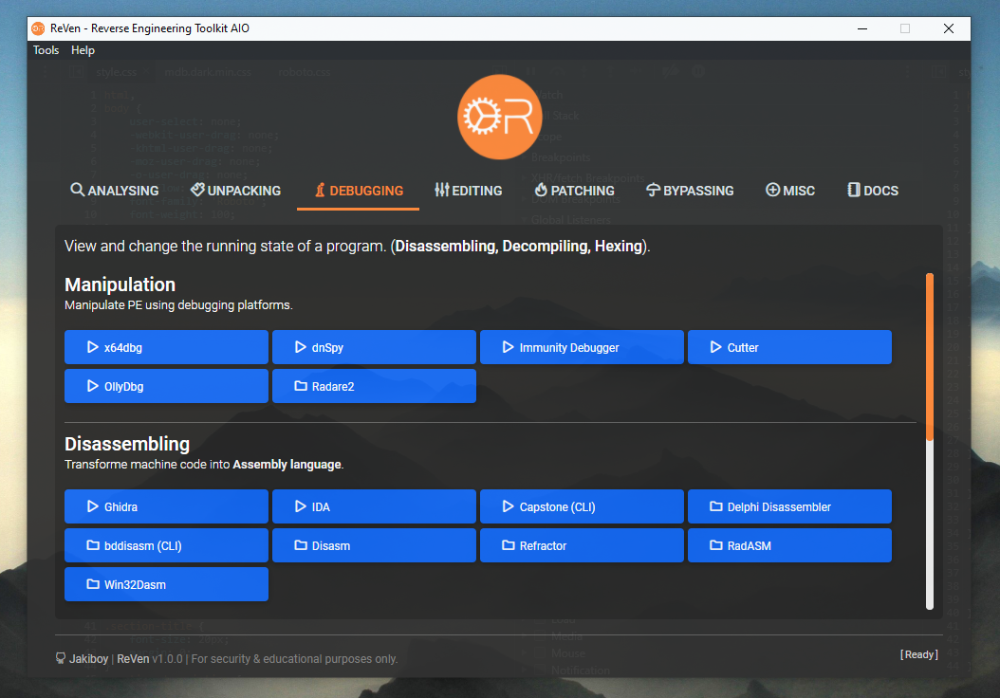
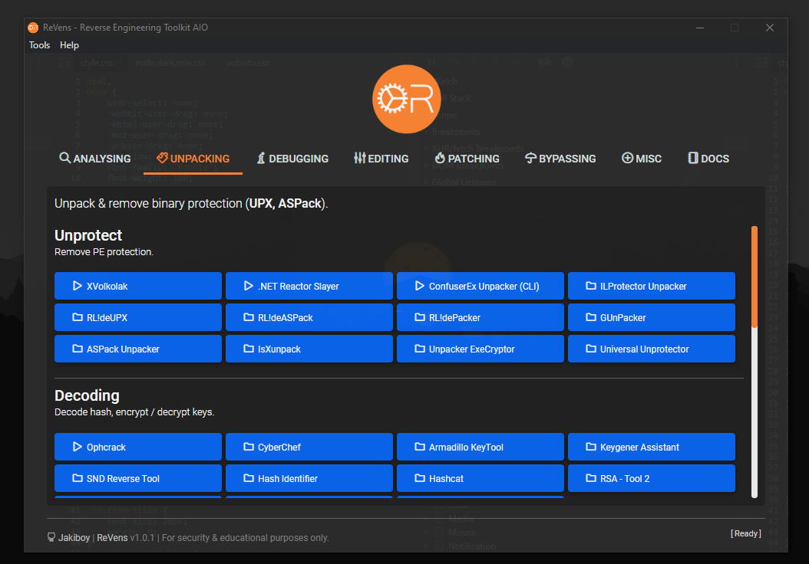
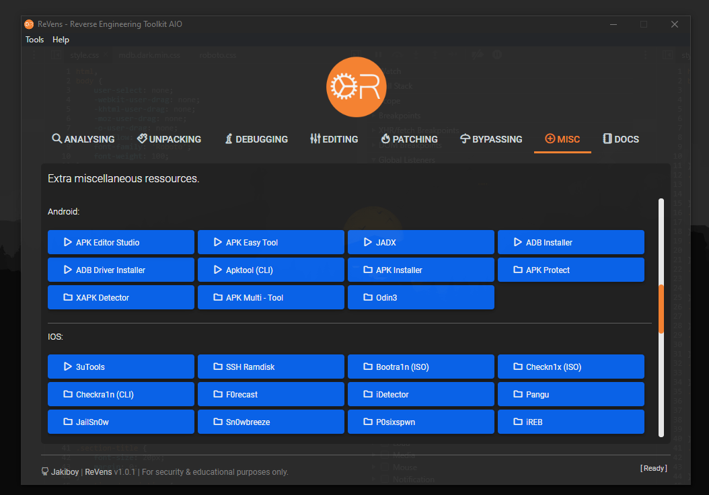

# ReVens: Reverse Engineering Toolkit AIO


ReVens is a Windows-based Reverse Engineering Toolkit "All-In-One", Built for <u>Security (Penetration testing)</u> & <u>Educational purposes only</u>.  
I made ReVens AIO app to share personal experience in RE since **2008**.

🌍 [Online preview](https://revens.jihadsinnaour.com)

## 🔧 Requirements

To run ReVens:

* **Windows 10/11 x64** *-Secured VM recommended-*.

To build ReVens:

* **Node.js** ^24.

## 💡 Notices

* Reverse Engineering tools are denied by **Antivirus** (Due to binary patching algorithms, debugging ...etc).
* **100% clean**: All detections are **false positives**, there's no malware included.
* You should make an **Antivirus** exception to avoid detection, or use a **secured** virtual machine.
* **ReVens Packages** ARE NOT automatically downloaded.
* Many of the included tools are **outdated** and provided solely for legacy purposes.
* **Packages** includes basic docs & tutorials about RE.
* **90% portable**.
* *-Use it on your own responsibility-*

## 🔧 Download

**ReVens GUI**

* Download from: [Releases](https://github.com/Jakiboy/ReVens/releases).

**ReVens Packages**

Download packages manually from (**~8Go**) :

* Part 1 - [Analysing](https://bit.ly/3x14Vd8)
* Part 2 - [Assembling](https://bit.ly/3VsyuhU)
* Part 3 - [Bypassing](https://bit.ly/4a24MFb)
* Part 4 - [Calculating](https://bit.ly/43QXQs9) - False positive
* Part 5 - [Comparing](https://bit.ly/3x6G1ZO)
* Part 6 - [Converting](https://bit.ly/4a6RozE)
* Part 7 - [Debugging](https://bit.ly/3TxhwMG)
* Part 8 - [Decoding](https://bit.ly/4a63rgs)
* Part 9 - [Decompiling](https://bit.ly/3Tqzi4t)
* Part 10 - [Dependencies](https://bit.ly/4a4p8xv) - Uplading to GG Drive...
* Part 11 - [Disassembling](https://bit.ly/3x8J43J) - Uplading to GG Drive...
* Part 12 - [Documentation](https://bit.ly/3TLUmU9)
* Part 13 - [Editing](https://bit.ly/498HUCo)
* Part 14 - [Encoding](https://bit.ly/4a3nQCV)
* Part 15 - [Extracting](https://bit.ly/3vnBu4F)
* Part 16 - [Hexing](https://bit.ly/4cv6TTB)
* Part 17 - [Mobile](https://bit.ly/3IQT5VC)
* Part 18 - [Packing](https://bit.ly/4apwGuw)
* Part 19 - [Patching](https://bit.ly/3Vppjit)
* Part 20 - [Programming](https://bit.ly/4a4nOux)
* Part 21 - [Testing](https://bit.ly/43sQgDU) - Uplading to GG Drive...
* Part 22 - [Unpacking](https://bit.ly/4aph2iQ)

Downloads should be extracted into */bin* folder.

## 🔧 Screenshots

This is how it looks, Made with {heart} using **Electron.js** + Some old {stuff}.



*The App background is the electron DevTools itself*.

<p float="left">
    
    
</p>

## 🔧 Install, Run & Build

```bash
bash global.sh
bash init.sh
bash run.sh
bash build.sh
```

## 🔧 Packages
  
ReVens packages includes:

### ⚡ Analysing

Analyse binary executable files (**EXE, DLL, OCX, SYS...**).

##### Binary

*Analyse binary.*

* **FileAlyzer** - *Analyze executable files.* (⭐)
* **Capa (CLI)** - *Identify capabilities in executables.* (⭐)
* **Alternate DLL Analyzer** - *Display function names in DLLs.*
* **ExeInfo** - *Universal binary analyzer.*
* **Yara** - *Malware pattern matching tool.*
* **Spyre** - *Simple YARA-based scanner.*
* **PE-bear** - *PE reversing tool.*
* **ClamAV** - *Open-source antivirus engine.*
* **Malzilla** - *Detect malicious scripts.*
* **Manalyze** - *Another malware analyzer.*
* **Sysinspector** - *Rootkits scanner.*
* **Windows Kernel Explorer** - *Another rootkits scanner.*

##### Compilation

*Analyse PE compilation.*

* **Detect It Easy (DiE)** - *File type identifier.* (⭐)
* **Nauz File Detector** - *Detects compiler tools.*
* **Language 2000** - *Comprehensive compiler detector.*
* **PE Detective** - *Identifies PE files.*
* **Signature Explorer** - *Manage advanced signatures.*

##### Bytecode (p-code)

*Object code converted by interpreter into binary machine code to be read by CPU.*

* **Bytecode Viewer** - *View, decompile Java/Android bytecode & more.*

##### Packaging

*Analyse PE packaging / protection.*

* **Exeinfo PE** - *Detects packers and compressors.* (⭐)
* **PEiD** - *Identifies packed executables.* (⭐)
* **ARiD** - *Identifies archive formats.*
* **UPX-Analyser** - *Analyzes UPX-packed files.*

##### System

*Analyse system (API, Process, Memory, Network, File).*

* **HijackThis** - *Malware analyser.* (⭐)
* **Process Monitor** - *Advansed monitoring tool for Windows.* (⭐)
* **API Monitor** - *Monitor Windows API calls.* (⭐)
* **Fiddler** - *Web debugging proxy.* (⭐)
* **SearchMyFiles** - *Advansed files finder.*
* **RegDLLView** - *Display the list of all registered DLL/OCX/EXE.*
* **WinObj** - *Windows object manager.*
* **WinID** - *Window information tool.*
* **HeapMemView** - *Inspect heap memory.*
* **CPU Stress** - *CPU stress testing tool.*
* **DeviceIOView** - *Monitor device I/O.*
* **Autoruns** - *Manage startup programs.*
* **Wireshark** - *Network packet analyzer.*
* **DLL Function Viewer** - *View DLL functions.*
* **Dependency Walker** - *32-bit/64-bit Windows module scanner.*
* **Exif Data View** - *Exif data Viewer.*
* **SQLite Tools** - *SQLite database tools.*
* **SQLite Browser** - *SQLite database browser.*
* **Process Explorer** - *Detailed process viewer.*
* **Process Hacker** - *Advanced process manager.*
* **Zero Dump** - *Create memory dumps.*
* **GDIView** - *Inspect GDI handles.*
* **grepWin** - *Search tool for Windows.*
* **PE Network Manager** - *Network Manager.*
* **NetworkMiner** - *Network forensics tool.*
* **SmartSniff** - *TCP/IP packets monitoring.*
* **TCPView** - *TCP/UDP viewer.*
* **Aircrack-ng** - *WiFi network security.*
* **SniffPass** - *Network passwords monitoring.*
* **WhoIs This Domain** - *Domain registration lookup utility.*
* **WhoIs Connected Sniffer** - *Network packets discovery tool.*
* **DNS Lookup View** - *DNS tracing tool.*

### ⚡ Calculating

Mathematical & reverse calculating.

* **Alternate Math Solver** - *Mathematical helper.*
* **Reverser Calculator** - *Calculator for reverse engineering.*
* **Hex-Dec** - *Hexadecimal to Decimal converter.*
* **JMP Calculator** - *Calculates JMP instructions.*
* **XOpcodeCalc** - *Opcode calculator tool.*
* **Jump to Hex** - *Jump instruction to hexadecimal.*
* **Hash Calculator** - *Calculates cryptographic hashes.*
* **Base Calculator** - *Calculates in different bases.*
* **Base Converter** - *Converts between bases.*

### ⚡ Converting

Convert binary files.

* **BAT to EXE**
* **PS1 to EXE**
* **VBS to EXE**
* **JAR to EXE**
* **DLL to EXE**
* **EXE to DLL**
* **PNG to ICO**
* **Audio Video to EXE**
* **RapidEXE (PHP - EXE) (CLI)**
* **RegConvert (REG - EXE)**
* **vbstoexe (CLI)**

### ⚡ Decompiling

Revert the process of compilation. Transforming binary program file into a **structured higher-level language**.

* **BinaryNinja** - *Advanced binary analysis platform.* (⭐)
* **.NET Reflector** - *.NET assembly browser and decompiler.* (⭐)
* **Dis# Net Decompiler** - *.NET decompiler for C#.* (⭐)
* **ILSpy** - *Open-source .NET assembly browser.*
* **dotPeek** - *.NET decompiler and assembly browser.*
* **Java Decompiler** - *Decompile Java class files.*
* **JByteMod** - *Java bytecode editor and decompiler.*
* **VB Decompiler** - *Decompile Visual Basic executables.*
* **DJ Java Decompiler** - *Java decompiler and disassembler.*
* **Exe2Aut** - *AutoIt3 decompiler.*
* **FFDec** - *Flash Decompiler.*

### ⚡ Disassembling

Transforming machine code into a human readable mnemonic representation (**Assembly language**).

* **Ghidra** - *Open-source software reverse engineering suite.* (⭐)
* **IDA** - *Interactive Disassembler for binary analysis.* (⭐)
* **RadASM** - *Rapid Application Development IDE.* (⭐)
* **Capstone (CLI)** - *Lightweight multi-architecture disassembly framework.*
* **Delphi Disassembler** - *Disassembler for Delphi executables.*
* **bddisasm (CLI)** - *Binary Ninja's disassembly library.*
* **Disasm** - *Generic disassembler for various architectures.*
* **Refractor** - *.NET decompiler and assembly browser.*
* **Win32Dasm** - *Windows 32-bit disassembler.*

### ⚡ Debugging

View and change the running state of a program. (**Disassembling, Decompiling, Hexing**).

* **x64dbg** - *Graphical debugger for x86 and x86-64 executables.* (⭐)
* **Immunity Debugger** - *Powerful and flexible debugger for Windows.* (⭐)
* **OllyDbg** - *Dynamic, 32-bit assembler level debugger for Windows.* (⭐)
* **dnSpy** - *.NET assembly editor, decompiler, and debugger.*
* **Cutter** - *Free and open-source reverse engineering platform.*
* **Radare2 (CLI)** - *A portable and multi-architecture reverse engineering framework.*
* **RenderDoc** - *Stand-alone graphics debugger.*

### ⚡ Hexing

Edit binary **hexadecimal values**.

* **ImHex** - *A fast and powerful hex editor.* (⭐)
* **Hiew** - *A hex viewer and editor for Windows.* (⭐)
* **HEX Editor** - *A tool for viewing and editing hexadecimal files.*

### ⚡ Rebuilding

Rebuild PE import table (**Imports Reconstructor**).

* **Scylla** - *A powerful and advanced x86/x86-64 executable unpacker.* (⭐)
* **LordPE** - *Another PE editor including imports reconstructing.* (⭐)
* **DLL Packager** - *A tool for bundling DLLs with executables.*
* **ImpREC** - *Import reconstructor for reconstructing imports in PE files.*

### ⚡ Decoding

Decode hash.

* **Ophcrack** - *Windows password cracker based on rainbow tables.* (⭐)
* **CyberChef** - *A web app for analyzing and decoding data.* (⭐)
* **Hashcat** - *Advanced password recovery.*
* **Armadillo KeyTool** - *Tool for working with Armadillo software protection.*
* **Keygener Assistant** - *Assists in generating keys for software.*
* **SND Reverse Tool** - *Reverse engineering tool for Windows binaries.*
* **Hash Identifier** - *Identifies the type of hash used in a string.*
* **RSA-Tool 2** - *Tool for generating and analyzing RSA keys.*
* **RSATool** - *Generate, convert and analyze RSA keys.*
* **RSABox** - *Toolkit for working with RSA encryption.*
* **MD5 Toolbox** - *Toolbox for working with MD5 hashes.*

### ⚡ Comparing

Binary compare.

* **WinMerge** - *Open-source tool for visual file comparison and merging.* (⭐)
* **REPT file compare** - *Tool for comparing binary files.* (⭐)
* **File CompareR** - *Utility for comparing files and directories.*
* **Table Text Compare** - *Simple CSV/Tab files compare.*
* **ReloX** - *Tool for comparing and analyzing binary files.*
* **SideBySide** - *Utility for side-by-side file comparison.*
* **SignMan** - *Utility for managing digital signatures.*

### ⚡ Editing

Binary edit (**EXE, RES, DLL**).

* **Resource Hacker** - *Resource editor for Windows executables.* (⭐)
* **PPEE** - *Powerful PE file viewer and editor.*
* **PE Lab** - *Interactive PE file (executable) analysis tool.*
* **Exiftool** - *Meta data editor.*
* **ReClassEx** - *Structure class reverser.*
* **ReClass.NET** - *.Net structure class reverser.*
* **XPEViewer** - *Executable file viewer and editor.*
* **XELFViewer** - *Viewer for ELF (Executable and Linkable Format) files.*
* **Robber** - *DLL hijacker.*
* **Xenos** - *DLL injector.*
* **DLL Injector Slait** - *Tool for injecting DLLs into processes.*
* **DLL Addr&Func Converter** - *Converts DLL addresses to function names.*
* **DLL Injector** - *Tool for injecting DLLs into processes.*
* **DLL Loader** - *Utility for loading DLL files into processes.*
* **DLL Rebaser** - *Utility for rebasing DLLs.*
* **ResEdit** - *Resource editor for Windows programs.*
* **CFF Explorer** - *PE editor, hex editor, and more for Windows files.*
* **Resource Builder** - *Resource file editor and compiler.*
* **Splash Injector** - *Tool for injecting splash screens into programs.*
* **Far Manager** - *Text-based file and archive manager for Windows.*
* **KDiff3** - *File and directory diff and merge tool.*
* **IID King** - *Interface identifier lookup tool.*
* **Cheat Engine** - *Memory scanner/debugger for games and applications.*
* **EasyHook** - *Windows API Hooking.*
* **Notepad++** - *Free source code editor and Notepad replacement.*
* **Codejock Skin Builder** - *Tool for building custom UI skins.*
* **Codejock Resource Editor** - *Resource editor for Codejock software.*
* **Codejock MarkupPad** - *Editor for creating Codejock markup files.*
* **Codejock Command Bars Designer** - *Designer tool for command bars.*
* **Inno Setup** - *Installer for Windows programs.*
* **Inno Script Studio** - *Inno Setup script manager GUI.*
* **DMcsvEditor** - *Simple CSV/Tab file editor.*
* **XMLTreeEdit** - *Simple XML file editor.*

### ⚡ Extracting

Binary extracting (**EXE, RES, DLL**).

* **UniExtract2** - *Universal extractor for various archive formats.* (⭐)
* **DLL Export Viewer** - *View exported functions of a DLL file.*
* **Bintext** - *Fast and powerful text extractor.*
* **RegFileExport** - *Extract registry entries to a .reg file.*
* **RegScanner** - *Registry scanner.*
* **ResourcesExtract** - *Extract resources from executable files.*
* **DotNetResExtract** - *Extract .NET assembly resources.*
* **RegFromApp** - *Extracts registry entries created by an application.*
* **RegRipper** - *Another registry extractor.*
* **Inno Extractor** - *Tool for extracting Inno Setup installers.*
* **Innoextract (CLI)** - *Command-line Inno Setup unpacker.*
* **Innounp (CLI)** - *Inno Setup unpacker, a command-line version.*
* **MSI Unpacker** - *Extract files from MSI installers.*
* **Fearless MSI Unpacker** - *Tool for unpacking MSI installers.*
* **LessMSI (CLI)** - *Command-line tool to extract data from MSI files.*
* **Mmextract (CLI)** - *Command-line MSI and CAB extractor.*
* **ExeDumper** - *Utility to dump executable files.*
* **Table Extractor** - *Extract tables from executables or libraries.*
* **UEFITool** - *UEFI firmware image viewer and editor.*
* **Firmware Tables View** - *Firmware tables (ACPI, SMBIOS) viewer.*
* **ChromePass** - *Google chrome password recovery tool.*
* **PasswordFox** - *Mozilla firefox password recovery tool.*
* **WebBrowserPassView** - *Web password recovery tool.*
* **Password Scanner** - *Windows password recovery tool.*
* **Product Key Scanner** - *Windows product key Scanner.*
* **ProduKey** - *Another Windows product key Scanner.*

**Games**

* **Dragon UnPACKer** - *Tool for opening and extracting game resource files.*
* **Unity Assets Bundle Extractor** - *Utility for extracting Unity assets.*
* **Ninja Ripper** - *Tool for extracting 3D models from games.*
* **3D Ripper DX** - *Capture 3D models from DirectX 9 games.*
* **QuickBMS** - *File extraction and reimporting script engine.*
* **Unity Asset Editor** - *Tool for modifying Unity game assets.*
* **DevX Unity Unpacker** - *Utility for unpacking Unity game files.*
* **Unity Studio** - *Viewer and editor for Unity assets and bundles.*
* **UnityEx** - *Utility for extracting assets from Unity games.*
* **uTinyRipper** - *Unity asset extractor and exporter.*

### ⚡ Unpacking

Unpack & remove binary protection (**EXE, DLL**).

* **XVolkolak** - *Unpacker emulator.*
* **.NET Reactor Slayer** - *Deobfuscator and unpacker for .NET Reactor.*
* **ConfuserEx Unpacker (CLI)** - *Confuserex unpacker.*
* **ILProtector Unpacker** - *ILProtector unpacker.*
* **de4dot** - *.NET deobfuscator and unpacker.*
* **RL!deUPX** - *UPX unpacker.*
* **RL!deASPack** - *ASPack unpacker.*
* **RL!dePacker** - *Generic unpacker.*
* **GUnPacker** - *Universal unpacker.*
* **ASPack Unpacker** - *Another ASPack unpacker.*
* **IsXunpack** - *InstallShield installer extractor.*
* **Unpacker ExeCryptor** - *ExeCryptor unpacker.*
* **Universal Unprotector** - *Another universal unpacker.*

### ⚡ Patching

##### Patcher

*Generate patching program using binary compare.*

* **dUP 2** - *Utility for creating patches for software.* (⭐)
* **AT4RE Patcher** - *Patch creator for software modification.*
* **CodeFusion** - *Patch creator and modifier for software.*
* **uPPP** - *Patch creation tool for software modification.*
* **Apatch** - *Tool for creating patches for software.*
* **Inno Setup XDELTA Patch Maker** - *Patch creator for Inno Setup.*
* **PEiD Patch Maker** - *Patch creator for PEiD signatures.*
* **Graphical Patch Maker** - *Tool for creating graphical patches.*

##### Loader

*Build binary patch loader.*

* **Advanced Loader Generator** - *Tool for generating loaders.*
* **Abel Loader Generator** - *Another tool for generating loaders.*

##### Keygen

*Build Key generator.*

* **REPT Keygen Maker** - *Tool for generating keygens.*

##### Skin

*Build patcher skin.*

* **Dup2AP Skin Converter** - *Converts skins for Dup2AP software.*
* **Image Flipper** - *Flips images horizontally or vertically.*
* **Skin Builder** - *Tool for creating custom skins.*
* **Skin Extractor** - *Extracts skins from applications.*
* **uPPP2AP Skin Converter** - *Converts skins for uPPP2AP software.*
* **RGNerator** - *Generates resource scripts for skinning tools.*

##### Release

*Build patcher release file.*

* **Release Builder** - *Tool for building software releases.* (⭐)
* **DizView** - *View and edit file descriptions (DIZ files).*
* **Fast Cracktro Maker** - *Create fast crack intros for software.*
* **mRelease Builder** - *Tool for building software releases.*
* **NFO Maker** - *Create NFO files for software releases.*
* **NFO Scroller** - *Scroll NFO files in a marquee style.*
* **NFO View** - *View NFO files with syntax highlighting.*
* **NFO Viewer 2** - *View NFO files with enhanced features.*

##### ASCII

*Build patcher release ASCII.*

* **Ascgen** - *Generate ASCII art from images.* (⭐)
* **1337 Converter** - *Convert text to "leet speak" (1337).*
* **ASCII Art studio** - *Create ASCII art and export images.*
* **ASCII Converter** - *Convert text to ASCII characters.*
* **ASCII Generator** - *Generate ASCII art from text.*
* **ASCII Table** - *Display an ASCII character table.*
* **Magic ASCII Pic** - *Create ASCII art from images.*

##### Sound

*Build patcher sound (MX).*

* **FastTracker 2** - *Popular tracker software for creating music.* (⭐)
* **MilkyTracker** - *Multi-platform music tracker inspired by FastTracker 2.* (⭐)
* **OpenMPT** - *Open-source tracker software.*
* **ModPlug Player** - *Player for module files including MOD, S3M, and XM.*
* **ChipRip** - *Tool for extracting audio from chiptune files.*

### ⚡ Bypassing

##### Trial

*Trial reset.*

* **RunAsDate** - *Utility for running programs with a specified date.*
* **DateHack** - *Tool for modifying system dates for software trials.*
* **Trial-Reset** - *Tool for extending trial periods of software.*

##### System

*Bypassing system.*

* **ScyllaHide** - *Plugin for hiding processes from various process tools.* (⭐)
* **RunFromProcess** - *Tool for running processes from a different process.*

---

### ⚡ Assembling

Assembling **Machine code**.

* **Flat assembler (FASM)** - *A fast, self-hosting assembly language compiler for x86 architecture.* (⭐)

### ⚡ Programming

Programming tools (**Compilators**).

* **PyScripter** - *Free and open-source Python integrated development environment (IDE).* (⭐)
* **AutoIt** - *Scripting language designed for automating the Windows GUI.* (⭐)
* **Dev-C++** - *Free, portable, and open-source integrated development environment (IDE) for C and C++.* (⭐)
* **Small Basic** - *A simple, beginner-friendly programming language and IDE.* (⭐)
* **AutoPlay Media Studio (AMS)** - *Easy-to-use & visual drag-and-drop software development tool.* (⭐)
* **Embarcadero Dev-C++** - *Integrated development environment for C and C++ programming.*

### ⚡ Encoding

Data encoding (**Hash**).

* **Hasher** - *Generate hash values for files using various algorithms.* (⭐)
* **WinHasher** - *Hash generator and checker for Windows.*
* **Alternate Hash Generator** - *Hashing tool for file verification.*
* **PuTTY** - *A free SSH and telnet client for Windows.*
* **XCA** - *A certificate generation tool.*
* **HashMyFiles** - *Tool to calculate and verify hash values.*
* **XOR** - *Tool for bitwise XOR operations on files.*
* **Base64 (CLI)** - *Command-line tool for Base64 encoding and decoding.*
* **MD5 (CLI)** - *Command-line tool for MD5 hashing.*
* **SHA1 (CLI)** - *Command-line tool for SHA1 hashing.*
* **Dissecting RC4 Algorithm** - *Analyzes the RC4 encryption algorithm.*
* **DSS-DSA Generator** - *Tool for generating DSA keys.*
* **gRn-Rsa-Donkey** - *RSA key generator.*

### ⚡ Packing

Executable packing.

* **UPX** - *Free, portable, and extendable executable packer.* (⭐)
* **ConfuserEx** - *Open-source protector for .NET applications.*
* **Alternate EXE Packer** - *A program to pack executable files.*
* **Amber** - *Cryptographic hashing tool for files.*

### ⚡ Testing

##### Simulating

Circuit / Logical simulation.

* **Fritzing** - *An open-source electronics design software.* (⭐)
* **Arduino Simulator** - *Software for simulating Arduino circuits.* (⭐)
* **Arduino CLI** - *Command-line interface for Arduino.*
* **PICSimLab** - *PIC microcontroller simulator.*
* **UnoArduSim** - *Arduino simulator and debugger.*
* **Dia** - *Diagram creation software.*
* **Logisim** - *Educational digital circuit simulator.*
* **SimulIDE** - *Real-time electronics simulator.*
* **Circuit Simulator** - *Software for simulating electronic circuits.*

##### Sandboxing

*Executables safe testing.*

* **Sandboxie Plus** - *Enhanced version of the popular sandboxing program.* (⭐)
* **Sandboxie Classic** - *Original version of the sandboxing program.* (⭐)

---

### ⚡ Mobile

##### Universal

Universal mobile toolkits.

* **Etcher** - *A cross-platform tool to flash OS images onto SD cards and USB.*
* **OTP Extractor** - *Tool for extracting OTPs (One-Time Passwords).*
* **WhatsApp Extractor (CLI)** - *Command-line tool for extracting WhatsApp data.*
* **WhatsApp Viewer** - *Viewer for WhatsApp chat histories.*

##### Android

* **APK Editor Studio** - *Powerful APK editing tool.* (⭐)
* **APK Easy Tool** - *APK management utility for Windows.*
* **JADX** - *Dex to Java decompiler.*
* **ADB Installer**
* **ADB Driver Installer**
* **APK Installer**
* **Odin** - *Samsung Android ROM flashing Tool.*
* **Apktool (CLI)** - *Tool for decompiling and recompiling Android APK files.*
* **APK Protect** - *Tool for protecting Android applications.*
* **XAPK Detector** - *Detects and handles XAPK files.*
* **APK Multi-Tool** - *Tool for managing and modifying Android APK files.*

##### iOS

* **3uTools** - *Tool for flashing and jailbreaking iOS.* (⭐)
* **SSH Ramdisk** - *iPhone ramdisk control.* (⭐)
* **Bootra1n (ISO)** - *Enough Linux for checkra1n.*
* **Checkn1x (ISO)** - *Jailbreaking iOS devices.*
* **Checkra1n** - *Another jailbreak tool.*
* **F0recast** - *Check iOS device jailbreak/unlock status.*
* **iDetector** - *Check iOS bootrom.*
* **Pangu** - *Another jailbreak tool.*
* **JailSn0w** - *iCloud activation bypass.*
* **Sn0wbreeze** - *Custom IPSWs generator.*
* **P0sixspwn** - *Yet another iOS jailbreaking tool.*
* **iREB** - *iTunes custom IPSWs bypass tool.*

## 🔧 TODO

* Improve UI using **React.js**.
* Update **Electron.js** to the latest (+ Dependencies).
* Use public cloud for packages hosting.
* Use internal **Node.js** packages downloader & extractor.
* Add updater (including packages **path.json**).
* Update Docs, (Add Links to active RE challenges & Forums, Remove outdated...).

## Authors:

* [Jakiboy](https://github.com/Jakiboy) (*Initial work*)
* Any PR is welcome!

### ⭐ Support:

Please give it a Star if you like the project.
