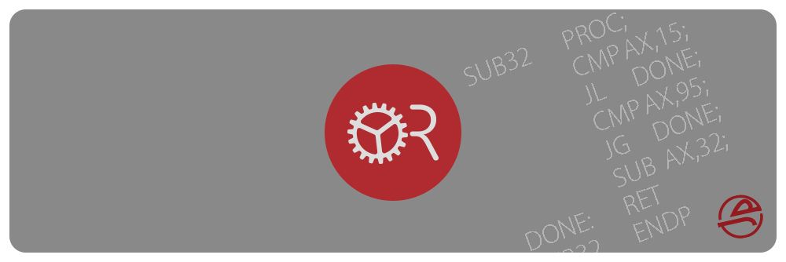
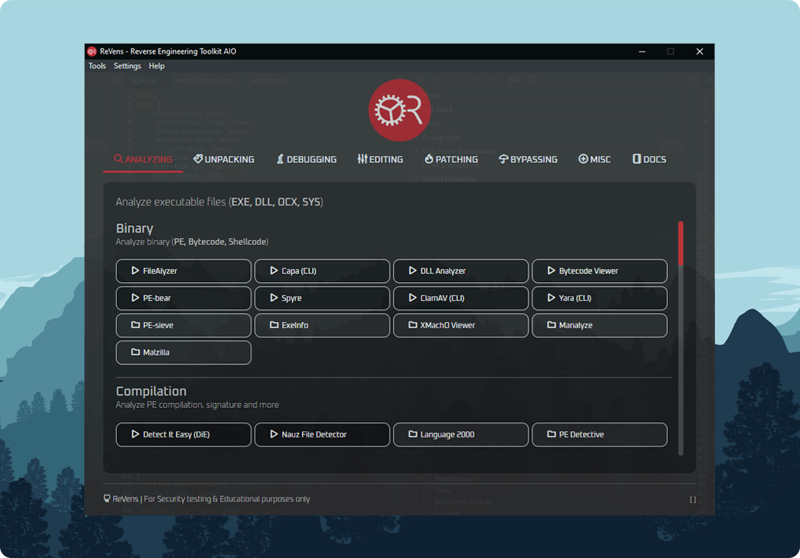

# ReVens: Reverse Engineering Toolkit AIO

[](#)

ReVens is a Windows-based Reverse Engineering Toolkit "All-In-One", Built for <u>Security (Malware analysis, Penetration testing)</u> & <u>Educational purposes only</u>. **-V2 Under development-**

> [!Note]
> I made ReVens AIO software to share personal experience in RE since **2008**.  
> RE tools are priceless, especially the legacy ones. They deserve a nice place where they can live in peace.  
> [Watch online preview](https://revens.jihadsinnaour.com).

## 🔧 Features

* **Cross-platform & Modern UI** software launcher "Blackhat style"
* **100% clean**: All detections are **false positives**, No malware injected
* **90% portable** (Resolved/Included dependencies)
* Original assets (e.g. **BRD - Teleport Pro.mx**, **CORE - Power ISO.xm**)
* Packages **Auto-updater** (JSON based source file)
* Boilerplate of <s>Electron.js</s> **Bun** + **React.js**

## 🔧 Screenshot

This is how it looks, Made with {heart} using <s>Electron.js</s> **Bun** + **React.js**.

[](#)

*The App background is the WebView DevTools itself*.

## 💡 Notices

> [!Important]
> Respecting the rights of software developers is paramount. Engaging in activities such as bypassing software protections or reverse engineering software without explicit permission is not only generally illegal, but also unethical. It's essential to utilize software in the manner intended by its creators and in compliance with the stipulated terms of service or license agreement.

* Reverse Engineering tools are denied by **Antivirus** (Due to binary patching algorithms, debugging ...etc).
* You should make an **Antivirus** exception to avoid detection, or use a **secured** virtual machine.
* **ReVens Packages** ARE <s>NOT</s> automatically downloaded from GitHub.
* Many of the included tools are **outdated** and provided solely for legacy purposes!
* **Packages** includes basic docs & tutorials about RE.
* Packages primary architecture is x64, but other architectures (x86, ARM) can also be supported.
* *-Use it on your own responsibility-*

## 🔧 Requirements

To run ReVens, **Windows** 10/11 (x64) is required.

## 🔧 Download

* Download ReVens GUI from: [Releases](https://github.com/Jakiboy/ReVens/releases).
* Download packages manually (**~8Go**) from:

<table>
  <tr>
    <th>Part 1</th>
    <th>Part 2</th>
    <th>Part 3</th>
    <th>Part 4</th>
    <th>Part 5</th>
    <th>Part 6</th>
    <th>Part 7</th>
  </tr>
  <tr>
    <td><a href="https://revens.jihadsinnaour.com/download/Analysing.iso" target="_blank">Analysing</a></td>
    <td><a href="https://revens.jihadsinnaour.com/download/Assembling.iso" target="_blank">Assembling</a></td>
    <td><a href="https://revens.jihadsinnaour.com/download/Bypassing.iso" target="_blank">Bypassing</a></td>
    <td><a href="https://revens.jihadsinnaour.com/download/Calculating.iso" target="_blank">Calculating</a></td>
    <td><a href="https://revens.jihadsinnaour.com/download/Comparing.iso" target="_blank">Comparing</a></td>
    <td><a href="https://revens.jihadsinnaour.com/download/Converting.iso" target="_blank">Converting</a></td>
    <td><a href="https://revens.jihadsinnaour.com/download/Debugging.iso" target="_blank">Debugging</a></td>
  </tr>
</table>

<table>
  <tr>
    <th>Part 8</th>
    <th>Part 9</th>
    <th>Part 10</th>
    <th>Part 11</th>
    <th>Part 12</th>
    <th>Part 13</th>
  </tr>
  <tr>
    <td><a href="https://revens.jihadsinnaour.com/download/Decoding.iso" target="_blank">Decoding</a></td>
    <td><a href="https://revens.jihadsinnaour.com/download/Decompiling.iso" target="_blank">Decompiling</a></td>
    <td><a href="https://revens.jihadsinnaour.com/download/Dependencies.iso" target="_blank">Dependencies</a></td>
    <td><a href="https://revens.jihadsinnaour.com/download/Disassembling.iso" target="_blank">Disassembling</a></td>
    <td><a href="https://revens.jihadsinnaour.com/download/Documentation.iso" target="_blank">Documentation</a></td>
    <td><a href="https://revens.jihadsinnaour.com/download/Unpacking.iso" target="_blank">Unpacking</a></td>
  </tr>
</table>

<table>
  <tr>
    <th>Part 14</th>
    <th>Part 15</th>
    <th>Part 16</th>
    <th>Part 17</th>
    <th>Part 18</th>
    <th>Part 19</th>
    <th>Part 20</th>
    <th>Part 21</th>
    <th>Part 22</th>
  </tr>
  <tr>
    <td><a href="https://revens.jihadsinnaour.com/download/Editing.iso" target="_blank">Editing</a></td>
    <td><a href="https://revens.jihadsinnaour.com/download/Encoding.iso" target="_blank">Encoding</a></td>
    <td><a href="https://revens.jihadsinnaour.com/download/Extracting.iso" target="_blank">Extracting</a></td>
    <td><a href="https://revens.jihadsinnaour.com/download/Hexing.iso" target="_blank">Hexing</a></td>
    <td><a href="https://revens.jihadsinnaour.com/download/Mobile.iso" target="_blank">Mobile</a></td>
    <td><a href="https://revens.jihadsinnaour.com/download/Packing.iso" target="_blank">Packing</a></td>
    <td><a href="https://revens.jihadsinnaour.com/download/Patching.iso" target="_blank">Patching</a></td>
    <td><a href="https://revens.jihadsinnaour.com/download/Programming.iso" target="_blank">Programming</a></td>
    <td><a href="https://revens.jihadsinnaour.com/download/Testing.iso" target="_blank">Testing</a></td>
  </tr>
</table>

Downloads should be extracted into ReVens */bin* folder.

## 🔧 Install, Run & Build

To build ReVens:

* <s>Electron.js ^29.4.0 (Node 20.9.0)</s> **Bun** ^1.2.0
* **MinGW-w64**

ReVens command-line:

```bash
bash init.sh
bash dev.sh
bash run.sh
bash build.sh
```

## 🔧 TODO

* Upload legacy packages (.iso) on GitHub.
* Use [Rust](https://www.rust-lang.org/) WebView & [Bun](https://bun.sh/) instead of [Electron.js](https://www.electronjs.org/) (Performance).
* Migrate to TypeScript.
* Add AI-powered Reverse Engineering Agent.
* Add Browser-level Reverse Engineering Resources ([WASM](https://webassembly.org/)).
* Add Search feature to find tools by name. ([By @MOAHSA](https://github.com/MOAHSA)).

## 🔧 Packages

ReVens packages includes:

### ⚡ Analyzing

Analyse binary executable files (**EXE, DLL, OCX, SYS...**).

##### Binary

*Analyse binary.*

* **FileAlyzer** - *Understand files by analyzing their structure.* (⭐)
* **[Capa (CLI)](https://github.com/mandiant/capa)** - *Identify capabilities in executables.* (⭐)
* **Alternate DLL Analyzer** - *Display function names in DLLs.*
* **ExeInfo** - *Universal binary analyzer.*
* **[Yara](https://github.com/VirusTotal/yara)** - *Malware pattern matching tool.*
* **[Spyre](https://github.com/spyre-project/spyre)** - *Simple YARA-based scanner.*
* **[PE-bear](https://github.com/hasherezade/pe-bear-releases)** - *PE reversing tool.*
* **[ClamAV](https://github.com/Cisco-Talos/clamav)** - *Open-source antivirus engine.*
* **Malzilla** - *Detect malicious scripts.*
* **[Manalyze](https://github.com/JusticeRage/Manalyze)** - *Another malware analyzer.*
* **Sysinspector** - *Rootkits scanner.*
* **[Windows Kernel Explorer](https://github.com/AxtMueller/Windows-Kernel-Explorer)** - *Another rootkits scanner.*

##### Compilation

*Analyse PE compilation.*

* **[Detect It Easy (DiE)](https://github.com/horsicq/Detect-It-Easy)** - *File type identifier.* (⭐)
* **Nauz File Detector** - *Detects compiler tools.*
* **Language 2000** - *Comprehensive compiler detector.*
* **PE Detective** - *Identifies PE files.*
* **Signature Explorer** - *Manage advanced signatures.*

##### Bytecode (p-code)

*Object code converted by interpreter into binary machine code to be read by CPU.*

* **[Bytecode Viewer](https://github.com/Konloch/bytecode-viewer)** - *View, decompile Java/Android bytecode & more.*

##### Packaging

*Analyse PE packaging / protection.*

* **Exeinfo PE** - *Detects packers and compressors.* (⭐)
* **PEiD** - *Identifies packed executables.* (⭐)
* **ARiD** - *Identifies archive formats.*
* **UPX-Analyser** - *Analyzes UPX-packed files.*

##### System

*Analyse system (API, Process, Memory, Network, File).*

* **[HijackThis](https://github.com/dragokas/hijackthis)** - *Malware analyser.* (⭐)
* **[Process Monitor](https://github.com/Microsoft/ProcMon-for-Linux)** - *Advansed monitoring tool for Windows.* (⭐)
* **[API Monitor](https://github.com/rohitab/API-Monitor)** - *Monitor Windows API calls.* (⭐)
* **[Fiddler](https://github.com/telerik/fiddler-everywhere-app)** - *Web debugging proxy.* (⭐)
* **SearchMyFiles** - *Advansed files finder.*
* **RegDLLView** - *Display the list of all registered DLL/OCX/EXE.*
* **WinObj** - *Windows object manager.*
* **WinID** - *Window information tool.*
* **HeapMemView** - *Inspect heap memory.*
* **CPU Stress** - *CPU stress testing tool.*
* **DeviceIOView** - *Monitor device I/O.*
* **Autoruns** - *Manage startup programs.*
* **[Wireshark](https://github.com/wireshark/wireshark)** - *Network packet analyzer.*
* **DLL Function Viewer** - *View DLL functions.*
* **[Dependency Walker](https://github.com/lucasg/Dependencies)** - *32-bit/64-bit Windows module scanner.*
* **Exif Data View** - *Exif data Viewer.*
* **SQLite Tools** - *SQLite database tools.*
* **SQLite Browser** - *SQLite database browser.*
* **[Process Explorer](https://github.com/Microsoft/ProcExp-for-Linux)** - *Detailed process viewer.*
* **[Process Hacker](https://github.com/processhacker/processhacker)** - *Advanced process manager.*
* **Zero Dump** - *Create memory dumps.*
* **GDIView** - *Inspect GDI handles.*
* **[grepWin](https://github.com/stefankueng/grepWin)** - *Search tool for Windows.*
* **PE Network Manager** - *Network Manager.*
* **[NetworkMiner](https://github.com/netresec/NetworkMiner)** - *Network forensics tool.*
* **SmartSniff** - *TCP/IP packets monitoring.*
* **TCPView** - *TCP/UDP viewer.*
* **[Aircrack-ng](https://github.com/aircrack-ng/aircrack-ng)** - *WiFi network security.*
* **SniffPass** - *Network passwords monitoring.*
* **WhoIs This Domain** - *Domain registration lookup utility.*
* **WhoIs Connected Sniffer** - *Network packets discovery tool.*
* **DNS Lookup View** - *DNS tracing tool.*

### ⚡ Calculating

Mathematical & reverse calculating.

* **Alternate Math Solver** - *Mathematical helper.*
* **Reverser Calculator** - *Calculator for reverse engineering.*
* **Hex-Dec** - *Hexadecimal to Decimal converter.*
* **JMP Calculator** - *Calculates JMP instructions.*
* **XOpcodeCalc** - *Opcode calculator tool.*
* **Jump to Hex** - *Jump instruction to hexadecimal.*
* **Hash Calculator** - *Calculates cryptographic hashes.*
* **Base Calculator** - *Calculates in different bases.*
* **Base Converter** - *Converts between bases.*

### ⚡ Converting

Convert binary files.

* **BAT to EXE**
* **PS1 to EXE**
* **VBS to EXE**
* **JAR to EXE**
* **DLL to EXE**
* **EXE to DLL**
* **PNG to ICO**
* **Audio Video to EXE**
* **RapidEXE (PHP - EXE) (CLI)**
* **RegConvert (REG - EXE)**
* **vbstoexe (CLI)**

### ⚡ Decompiling

Revert the process of compilation. Transforming binary program file into a **structured higher-level language**.

* **[BinaryNinja](https://github.com/Vector35/binaryninja-api)** - *Advanced binary analysis platform.* (⭐)
* **.NET Reflector** - *.NET assembly browser and decompiler.* (⭐)
* **Dis# Net Decompiler** - *.NET decompiler for C#.* (⭐)
* **[ILSpy](https://github.com/icsharpcode/ILSpy)** - *Open-source .NET assembly browser.*
* **[dotPeek](https://github.com/JetBrains/resharper-devguide)** - *.NET decompiler and assembly browser.*
* **[Java Decompiler](https://github.com/java-decompiler/jd-gui)** - *Decompile Java class files.*
* **[JByteMod](https://github.com/GraxCode/JByteMod-Beta)** - *Java bytecode editor and decompiler.*
* **VB Decompiler** - *Decompile Visual Basic executables.*
* **DJ Java Decompiler** - *Java decompiler and disassembler.*
* **Exe2Aut** - *AutoIt3 decompiler.*
* **[FFDec](https://github.com/jindrapetrik/jpexs-decompiler)** - *Flash Decompiler.*

### ⚡ Disassembling

Transforming machine code into a human readable mnemonic representation (**Assembly language**).

* **[Ghidra](https://github.com/NationalSecurityAgency/ghidra)** - *Open-source software reverse engineering suite.* (⭐)
* **IDA** - *Interactive Disassembler for binary analysis.* (⭐)
* **RadASM** - *Rapid Application Development IDE.* (⭐)
* **[Capstone (CLI)](https://github.com/capstone-engine/capstone)** - *Lightweight multi-architecture disassembly framework.*
* **Delphi Disassembler** - *Disassembler for Delphi executables.*
* **[bddisasm (CLI)](https://github.com/bitdefender/bddisasm)** - *Binary Ninja's disassembly library.*
* **Disasm** - *Generic disassembler for various architectures.*
* **Refractor** - *.NET decompiler and assembly browser.*
* **Win32Dasm** - *Windows 32-bit disassembler.*

### ⚡ Debugging

View and change the running state of a program. (**Disassembling, Decompiling, Hexing**).

* **[x64dbg](https://github.com/x64dbg/x64dbg)** - *Graphical debugger for x86 and x86-64 executables.* (⭐)
* **[Immunity Debugger](https://github.com/kbandla/ImmunityDebugger)** - *Powerful and flexible debugger for Windows.* (⭐)
* **OllyDbg** - *Dynamic, 32-bit assembler level debugger for Windows.* (⭐)
* **[dnSpy](https://github.com/dnSpy/dnSpy)** - *.NET assembly editor, decompiler, and debugger.*
* **[Cutter](https://github.com/rizinorg/cutter)** - *Free and open-source reverse engineering platform.*
* **[Radare2 (CLI)](https://github.com/radareorg/radare2)** - *A portable and multi-architecture reverse engineering framework.*
* **[RenderDoc](https://github.com/baldurk/renderdoc)** - *Stand-alone graphics debugger.*

### ⚡ Hexing

Edit binary **hexadecimal values**.

* **[ImHex](https://github.com/WerWolv/ImHex)** - *A fast and powerful hex editor.* (⭐)
* **Hiew** - *A hex viewer and editor for Windows.* (⭐)
* **HEX Editor** - *A tool for viewing and editing hexadecimal files.*

### ⚡ Rebuilding

Rebuild PE import table (**Imports Reconstructor**).

* **[Scylla](https://github.com/NtQuery/Scylla)** - *A powerful and advanced x86/x86-64 executable unpacker.* (⭐)
* **LordPE** - *Another PE editor including imports reconstructing.* (⭐)
* **DLL Packager** - *A tool for bundling DLLs with executables.*
* **ImpREC** - *Import reconstructor for reconstructing imports in PE files.*

### ⚡ Decoding

Decode hash.

* **[Ophcrack](https://github.com/Zyzonix/ophcrack)** - *Windows password cracker based on rainbow tables.* (⭐)
* **[CyberChef](https://github.com/gchq/CyberChef)** - *A web app for analyzing and decoding data.* (⭐)
* **[Hashcat](https://github.com/hashcat/hashcat)** - *Advanced password recovery.*
* **Armadillo KeyTool** - *Tool for working with Armadillo software protection.*
* **Keygener Assistant** - *Assists in generating keys for software.*
* **SND Reverse Tool** - *Reverse engineering tool for Windows binaries.*
* **Hash Identifier** - *Identifies the type of hash used in a string.*
* **RSA-Tool 2** - *Tool for generating and analyzing RSA keys.*
* **RSATool** - *Generate, convert and analyze RSA keys.*
* **RSABox** - *Toolkit for working with RSA encryption.*
* **MD5 Toolbox** - *Toolbox for working with MD5 hashes.*

### ⚡ Comparing

Binary compare.

* **[WinMerge](https://github.com/WinMerge/winmerge)** - *Open-source tool for visual file comparison and merging.* (⭐)
* **REPT file compare** - *Tool for comparing binary files.* (⭐)
* **File CompareR** - *Utility for comparing files and directories.*
* **Table Text Compare** - *Simple CSV/Tab files compare.*
* **ReloX** - *Tool for comparing and analyzing binary files.*
* **SideBySide** - *Utility for side-by-side file comparison.*
* **SignMan** - *Utility for managing digital signatures.*

### ⚡ Editing

Binary edit (**EXE, RES, DLL**).

* **[Resource Hacker](https://github.com/TDMakerInc/ResourceHacker)** - *Resource editor for Windows executables.* (⭐)
* **PPEE** - *Powerful PE file viewer and editor.*
* **PE Lab** - *Interactive PE file (executable) analysis tool.*
* **[Exiftool](https://github.com/exiftool/exiftool)** - *Meta data editor.*
* **[ReClassEx](https://github.com/ReClassNET/ReClass.NET)** - *Structure class reverser.*
* **[ReClass.NET](https://github.com/ReClassNET/ReClass.NET)** - *.Net structure class reverser.*
* **XPEViewer** - *Executable file viewer and editor.*
* **XELFViewer** - *Viewer for ELF (Executable and Linkable Format) files.*
* **Robber** - *DLL hijacker.*
* **[Xenos](https://github.com/DarthTon/Xenos)** - *DLL injector.*
* **DLL Injector Slait** - *Tool for injecting DLLs into processes.*
* **DLL Addr&Func Converter** - *Converts DLL addresses to function names.*
* **DLL Injector** - *Tool for injecting DLLs into processes.*
* **DLL Loader** - *Utility for loading DLL files into processes.*
* **DLL Rebaser** - *Utility for rebasing DLLs.*
* **ResEdit** - *Resource editor for Windows programs.*
* **[CFF Explorer](https://github.com/ntddk/CFF-Explorer)** - *PE editor, hex editor, and more for Windows files.*
* **Resource Builder** - *Resource file editor and compiler.*
* **Splash Injector** - *Tool for injecting splash screens into programs.*
* **[Far Manager](https://github.com/FarGroup/FarManager)** - *Text-based file and archive manager for Windows.*
* **[KDiff3](https://github.com/KDE/kdiff3)** - *File and directory diff and merge tool.*
* **IID King** - *Interface identifier lookup tool.*
* **[Cheat Engine](https://github.com/cheat-engine/cheat-engine)** - *Memory scanner/debugger for games and applications.*
* **[EasyHook](https://github.com/EasyHook/EasyHook)** - *Windows API Hooking.*
* **[Notepad++](https://github.com/notepad-plus-plus/notepad-plus-plus)** - *Free source code editor and Notepad replacement.*
* **Codejock Skin Builder** - *Tool for building custom UI skins.*
* **Codejock Resource Editor** - *Resource editor for Codejock software.*
* **Codejock MarkupPad** - *Editor for creating Codejock markup files.*
* **Codejock Command Bars Designer** - *Designer tool for command bars.*
* **[Inno Setup](https://github.com/jrsoftware/issrc)** - *Installer for Windows programs.*
* **Inno Script Studio** - *Inno Setup script manager GUI.*
* **DMcsvEditor** - *Simple CSV/Tab file editor.*
* **XMLTreeEdit** - *Simple XML file editor.*

### ⚡ Extracting

Binary extracting (**EXE, RES, DLL**).

* **[UniExtract2](https://github.com/Bioruebe/UniExtract2)** - *Universal extractor for various archive formats.* (⭐)
* **DLL Export Viewer** - *View exported functions of a DLL file.*
* **Bintext** - *Fast and powerful text extractor.*
* **RegFileExport** - *Extract registry entries to a .reg file.*
* **RegScanner** - *Registry scanner.*
* **ResourcesExtract** - *Extract resources from executable files.*
* **DotNetResExtract** - *Extract .NET assembly resources.*
* **RegFromApp** - *Extracts registry entries created by an application.*
* **RegRipper** - *Another registry extractor.*
* **Inno Extractor** - *Tool for extracting Inno Setup installers.*
* **[Innoextract (CLI)](https://github.com/dscharrer/innoextract)** - *Command-line Inno Setup unpacker.*
* **[Innounp (CLI)](https://github.com/kichik/innounp)** - *Inno Setup unpacker, a command-line version.*
* **MSI Unpacker** - *Extract files from MSI installers.*
* **Fearless MSI Unpacker** - *Tool for unpacking MSI installers.*
* **[LessMSI (CLI)](https://github.com/activescott/lessmsi)** - *Command-line tool to extract data from MSI files.*
* **Mmextract (CLI)** - *Command-line MSI and CAB extractor.*
* **ExeDumper** - *Utility to dump executable files.*
* **Table Extractor** - *Extract tables from executables or libraries.*
* **[UEFITool](https://github.com/LongSoft/UEFITool)** - *UEFI firmware image viewer and editor.*
* **Firmware Tables View** - *Firmware tables (ACPI, SMBIOS) viewer.*
* **ChromePass** - *Google chrome password recovery tool.*
* **PasswordFox** - *Mozilla firefox password recovery tool.*
* **WebBrowserPassView** - *Web password recovery tool.*
* **Password Scanner** - *Windows password recovery tool.*
* **Product Key Scanner** - *Windows product key Scanner.*
* **ProduKey** - *Another Windows product key Scanner.*

**Games**

* **[Dragon UnPACKer](https://github.com/elbereth/DragonUnPACKer)** - *Tool for opening and extracting game resource files.*
* **[Unity Assets Bundle Extractor](https://github.com/SeriousCache/UABE)** - *Utility for extracting Unity assets.*
* **Ninja Ripper** - *Tool for extracting 3D models from games.*
* **3D Ripper DX** - *Capture 3D models from DirectX 9 games.*
* **[QuickBMS](https://github.com/Alkid/quickbms)** - *File extraction and reimporting script engine.*
* **Unity Asset Editor** - *Tool for modifying Unity game assets.*
* **DevX Unity Unpacker** - *Utility for unpacking Unity game files.*
* **Unity Studio** - *Viewer and editor for Unity assets and bundles.*
* **[UnityEx](https://github.com/Perfare/UnityStudio)** - *Utility for extracting assets from Unity games.*
* **[uTinyRipper](https://github.com/mafaca/UtinyRipper)** - *Unity asset extractor and exporter.*

### ⚡ Unpacking

Unpack & remove binary protection (**EXE, DLL**).

* **XVolkolak** - *Unpacker emulator.*
* **.NET Reactor Slayer** - *Deobfuscator and unpacker for .NET Reactor.*
* **[ConfuserEx Unpacker (CLI)](https://github.com/NotPrab/.NET-Deobfuscator)** - *Confuserex unpacker.*
* **ILProtector Unpacker** - *ILProtector unpacker.*
* **[de4dot](https://github.com/de4dot/de4dot)** - *.NET deobfuscator and unpacker.*
* **RL!deUPX** - *UPX unpacker.*
* **RL!deASPack** - *ASPack unpacker.*
* **RL!dePacker** - *Generic unpacker.*
* **GUnPacker** - *Universal unpacker.*
* **ASPack Unpacker** - *Another ASPack unpacker.*
* **IsXunpack** - *InstallShield installer extractor.*
* **Unpacker ExeCryptor** - *ExeCryptor unpacker.*
* **Universal Unprotector** - *Another universal unpacker.*

### ⚡ Patching

##### Patcher

*Generate patching program using binary compare.*

* **dUP 2** - *Utility for creating patches for software.* (⭐)
* **AT4RE Patcher** - *Patch creator for software modification.*
* **CodeFusion** - *Patch creator and modifier for software.*
* **uPPP** - *Patch creation tool for software modification.*
* **Apatch** - *Tool for creating patches for software.*
* **Inno Setup XDELTA Patch Maker** - *Patch creator for Inno Setup.*
* **PEiD Patch Maker** - *Patch creator for PEiD signatures.*
* **Graphical Patch Maker** - *Tool for creating graphical patches.*

##### Loader

*Build binary patch loader.*

* **Advanced Loader Generator** - *Tool for generating loaders.*
* **Abel Loader Generator** - *Another tool for generating loaders.*

##### Keygen

*Build Key generator.*

* **REPT Keygen Maker** - *Tool for generating keygens.*

##### Skin

*Build patcher skin.*

* **Dup2AP Skin Converter** - *Converts skins for Dup2AP software.*
* **Image Flipper** - *Flips images horizontally or vertically.*
* **Skin Builder** - *Tool for creating custom skins.*
* **Skin Extractor** - *Extracts skins from applications.*
* **uPPP2AP Skin Converter** - *Converts skins for uPPP2AP software.*
* **RGNerator** - *Generates resource scripts for skinning tools.*

##### Release

*Build patcher release file.*

* **Release Builder** - *Tool for building software releases.* (⭐)
* **DizView** - *View and edit file descriptions (DIZ files).*
* **Fast Cracktro Maker** - *Create fast crack intros for software.*
* **mRelease Builder** - *Tool for building software releases.*
* **NFO Maker** - *Create NFO files for software releases.*
* **NFO Scroller** - *Scroll NFO files in a marquee style.*
* **NFO View** - *View NFO files with syntax highlighting.*
* **NFO Viewer 2** - *View NFO files with enhanced features.*

##### ASCII

*Build patcher release ASCII.*

* **Ascgen** - *Generate ASCII art from images.* (⭐)
* **1337 Converter** - *Convert text to "leet speak" (1337).*
* **ASCII Art studio** - *Create ASCII art and export images.*
* **ASCII Converter** - *Convert text to ASCII characters.*
* **ASCII Generator** - *Generate ASCII art from text.*
* **ASCII Table** - *Display an ASCII character table.*
* **Magic ASCII Pic** - *Create ASCII art from images.*

##### Sound

*Build patcher sound (MX).*

* **FastTracker 2** - *Popular tracker software for creating music.* (⭐)
* **MilkyTracker** - *Multi-platform music tracker inspired by FastTracker 2.* (⭐)
* **OpenMPT** - *Open-source tracker software.*
* **ModPlug Player** - *Player for module files including MOD, S3M, and XM.*
* **ChipRip** - *Tool for extracting audio from chiptune files.*

### ⚡ Bypassing

##### Trial

*Trial reset.*

* **RunAsDate** - *Utility for running programs with a specified date.*
* **DateHack** - *Tool for modifying system dates for software trials.*
* **Trial-Reset** - *Tool for extending trial periods of software.*

##### System

*Bypassing system.*

* **[ScyllaHide](https://github.com/x64dbg/ScyllaHide)** - *Plugin for hiding processes from various process tools.* (⭐)
* **RunFromProcess** - *Tool for running processes from a different process.*

---

### ⚡ Assembling

Assembling **Machine code**.

* **[Flat assembler (FASM)](https://github.com/tgrysztar/fasm)** - *A fast, self-hosting assembly language compiler for x86 architecture.* (⭐)

### ⚡ Programming

Programming tools (**Compilators**).

* **PyScripter** - *Free and open-source Python integrated development environment (IDE).* (⭐)
* **[AutoIt](https://github.com/AutoIt/AutoIt-v3)** - *Scripting language designed for automating the Windows GUI.* (⭐)
* **[Dev-C++](https://github.com/Embarcadero/Dev-Cpp)** - *Free, portable, and open-source integrated development environment (IDE) for C and C++.* (⭐)
* **Small Basic** - *A simple, beginner-friendly programming language and IDE.* (⭐)
* **AutoPlay Media Studio (AMS)** - *Easy-to-use & visual drag-and-drop software development tool.* (⭐)
* **[Embarcadero Dev-C++](https://github.com/Embarcadero/Dev-Cpp)** - *Integrated development environment for C and C++ programming.*

### ⚡ Encoding

Data encoding (**Hash**).

* **Hasher** - *Generate hash values for files using various algorithms.* (⭐)
* **WinHasher** - *Hash generator and checker for Windows.*
* **Alternate Hash Generator** - *Hashing tool for file verification.*
* **[PuTTY](https://github.com/github/putty)** - *A free SSH and telnet client for Windows.*
* **[XCA](https://github.com/chris2511/xca)** - *A certificate generation tool.*
* **HashMyFiles** - *Tool to calculate and verify hash values.*
* **XOR** - *Tool for bitwise XOR operations on files.*
* **Base64 (CLI)** - *Command-line tool for Base64 encoding and decoding.*
* **MD5 (CLI)** - *Command-line tool for MD5 hashing.*
* **SHA1 (CLI)** - *Command-line tool for SHA1 hashing.*
* **Dissecting RC4 Algorithm** - *Analyzes the RC4 encryption algorithm.*
* **DSS-DSA Generator** - *Tool for generating DSA keys.*
* **gRn-Rsa-Donkey** - *RSA key generator.*

### ⚡ Packing

Executable packing.

* **[UPX](https://github.com/upx/upx)** - *Free, portable, and extendable executable packer.* (⭐)
* **[ConfuserEx](https://github.com/mkaring/ConfuserEx)** - *Open-source protector for .NET applications.*
* **Alternate EXE Packer** - *A program to pack executable files.*
* **Amber** - *Cryptographic hashing tool for files.*

### ⚡ Testing

##### Simulating

Circuit / Logical simulation.

* **[Fritzing](https://github.com/fritzing/fritzing-app)** - *An open-source electronics design software.* (⭐)
* **[Arduino Simulator](https://github.com/simulator-io/simulator-arduino)** - *Software for simulating Arduino circuits.* (⭐)
* **[Arduino CLI](https://github.com/arduino/arduino-cli)** - *Command-line interface for Arduino.*
* **PICSimLab** - *PIC microcontroller simulator.*
* **UnoArduSim** - *Arduino simulator and debugger.*
* **[Dia](https://github.com/GNOME/dia)** - *Diagram creation software.*
* **[Logisim](https://github.com/logisim-evolution/logisim-evolution)** - *Educational digital circuit simulator.*
* **[SimulIDE](https://github.com/SimulIDE/SimulIDE)** - *Real-time electronics simulator.*
* **Circuit Simulator** - *Software for simulating electronic circuits.*

##### Sandboxing

*Executables safe testing.*

* **[Sandboxie Plus](https://github.com/sandboxie-plus/Sandboxie)** - *Enhanced version of the popular sandboxing program.* (⭐)
* **Sandboxie Classic** - *Original version of the sandboxing program.* (⭐)

---

### ⚡ Mobile

##### Universal

Universal mobile toolkits.

* **[Etcher](https://github.com/balena-io/etcher)** - *A cross-platform tool to flash OS images onto SD cards and USB.*
* **OTP Extractor** - *Tool for extracting OTPs (One-Time Passwords).*
* **WhatsApp Extractor (CLI)** - *Command-line tool for extracting WhatsApp data.*
* **WhatsApp Viewer** - *Viewer for WhatsApp chat histories.*

##### Android

* **[APK Editor Studio](https://github.com/kefir500/apk-editor-studio)** - *Powerful APK editing tool.* (⭐)
* **APK Easy Tool** - *APK management utility for Windows.*
* **[JADX](https://github.com/skylot/jadx)** - *Dex to Java decompiler.*
* **ADB Installer**
* **ADB Driver Installer**
* **APK Installer**
* **Odin** - *Samsung Android ROM flashing Tool.*
* **[Apktool (CLI)](https://github.com/iBotPeaches/Apktool)** - *Tool for decompiling and recompiling Android APK files.*
* **APK Protect** - *Tool for protecting Android applications.*
* **XAPK Detector** - *Detects and handles XAPK files.*
* **APK Multi-Tool** - *Tool for managing and modifying Android APK files.*

##### iOS

* **3uTools** - *Tool for flashing and jailbreaking iOS.* (⭐)
* **SSH Ramdisk** - *iPhone ramdisk control.* (⭐)
* **Bootra1n (ISO)** - *Enough Linux for checkra1n.*
* **Checkn1x (ISO)** - *Jailbreaking iOS devices.*
* **Checkra1n** - *Another jailbreak tool.*
* **F0recast** - *Check iOS device jailbreak/unlock status.*
* **iDetector** - *Check iOS bootrom.*
* **Pangu** - *Another jailbreak tool.*
* **JailSn0w** - *iCloud activation bypass.*
* **Sn0wbreeze** - *Custom IPSWs generator.*
* **P0sixspwn** - *Yet another iOS jailbreaking tool.*
* **iREB** - *iTunes custom IPSWs bypass tool.*

### ⭐ Support:

Skip the coffee! If you like the project, a **star** would mean a lot.
